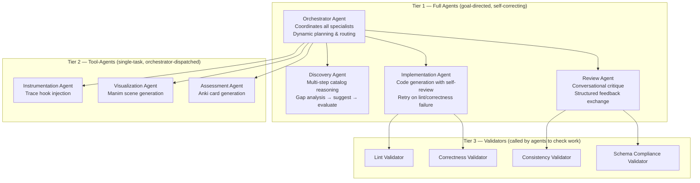
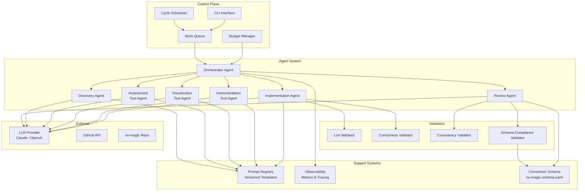
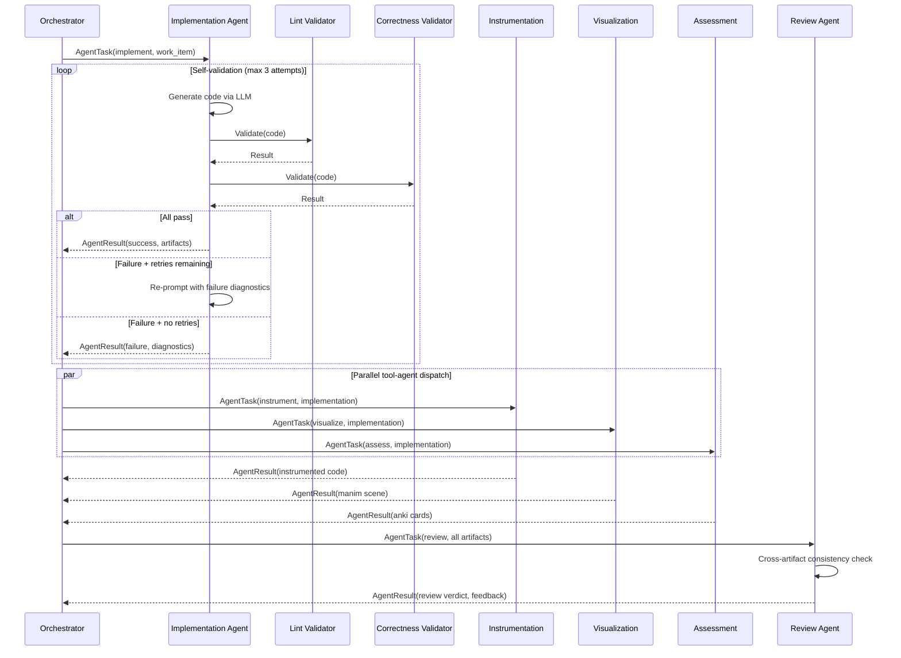
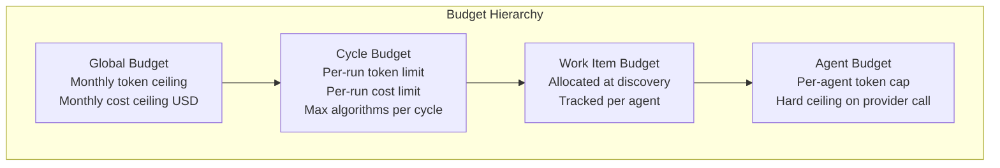
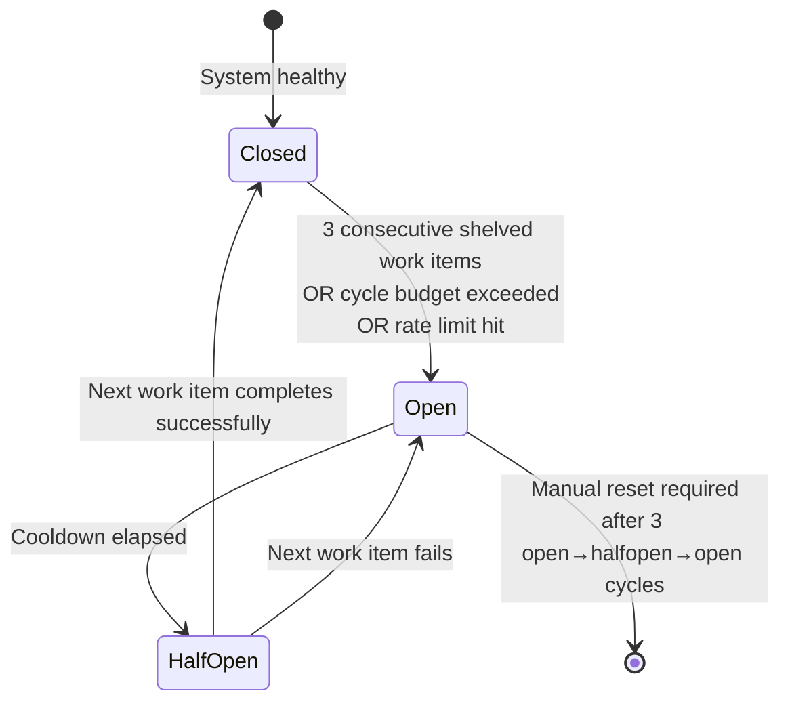
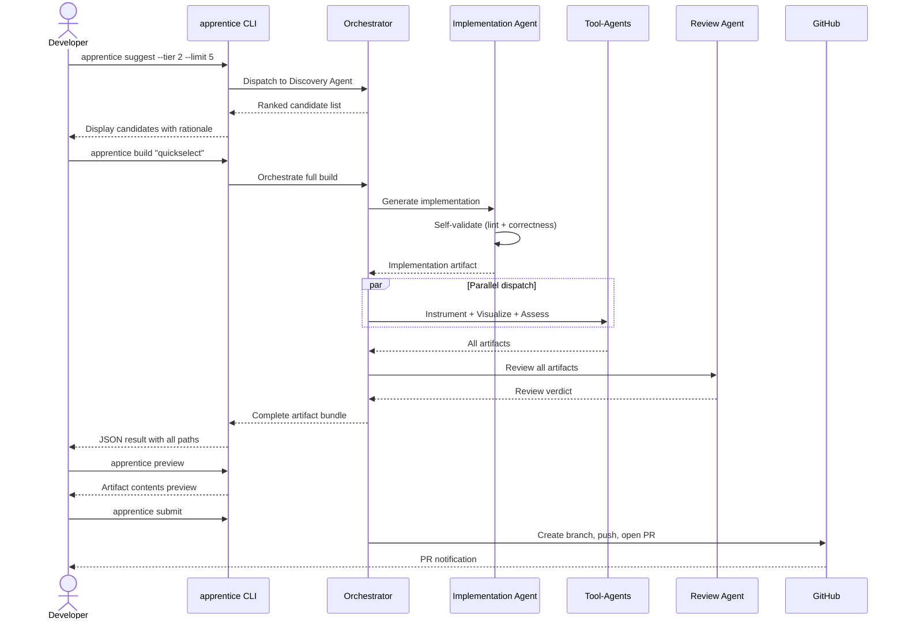
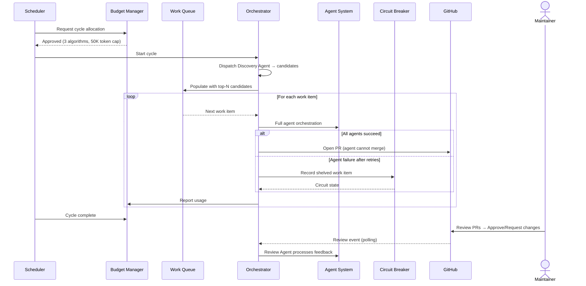
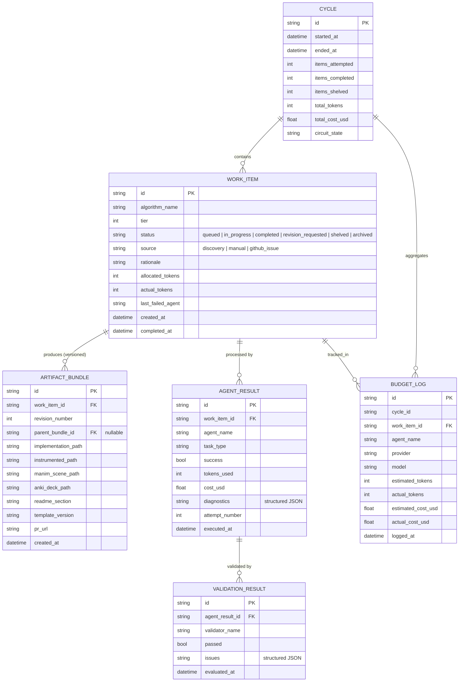
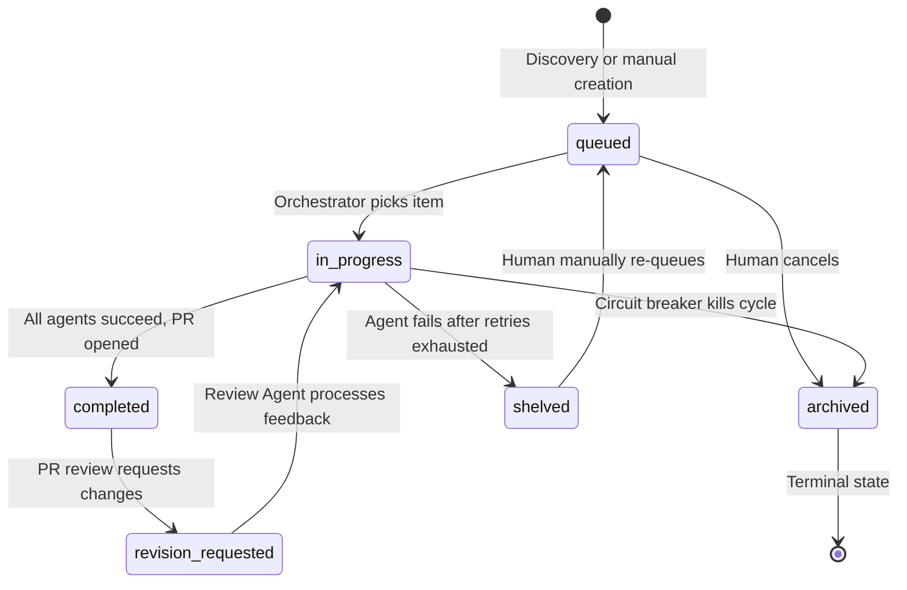

# apprentice — Multi-Agent Algorithm Factory for no-magic

> A multi-agent system that implements, instruments, visualizes, tests, and ships new algorithm entries for the no-magic ecosystem. Specialist agents coordinate under an orchestrator to produce complete educational content — from algorithm selection through PR submission.

**Repository**: `no-magic-ai/apprentice`
**Parent ecosystem**: `no-magic-ai/no-magic`

---

## 1. Naming Rationale

`apprentice` — a learner that produces work under supervision, gradually earning autonomy. Maps directly to the v1→v2 trajectory: assisted apprentice → autonomous apprentice with guardrails.

---

## 2. Problem Statement

no-magic currently has 41 algorithms across four tiers, each with:

- Single-file, zero-dependency Python implementation
- Manim animation for visual explanation
- Anki flashcard deck
- Learning track placement
- README documentation

Every new algorithm requires manually producing all five artifacts, maintaining consistency with existing conventions, and validating correctness. This is the bottleneck to catalog growth.

**apprentice** automates the full artifact pipeline using a multi-agent system where specialist agents handle implementation, visualization, assessment, and review — coordinated by an orchestrator that manages budget, sequencing, and quality enforcement.

---

## 3. Design Principles

| Principle                   | Implication                                                                                                                                                                                                                                                          |
| --------------------------- | -------------------------------------------------------------------------------------------------------------------------------------------------------------------------------------------------------------------------------------------------------------------- |
| **Multi-agent by design**   | Each specialist agent has a distinct role, system prompt, tool access, and reasoning loop. Agent boundaries correspond to intuitive roles, not arbitrary splits.                                                                                                     |
| **Honest agent boundaries** | Full agents (orchestrator, discovery, implementation, review) have goal-directed reasoning with self-correction. Tool-agents (instrumentation, visualization, assessment) are thin wrappers — making them full agents would add ceremony without behavioral benefit. |
| **Containment first**       | Autonomous mode has hard budget caps, rate limits, and mandatory human checkpoints. Agents cannot escalate their own permissions.                                                                                                                                    |
| **Artifact parity**         | Agent-generated entries are structurally indistinguishable from hand-crafted ones.                                                                                                                                                                                   |
| **Provider agnostic**       | LLM calls go through a thin provider interface. No vendor lock-in.                                                                                                                                                                                                   |
| **Prompt transparency**     | All prompts are versioned, templated, and stored separately from agent logic.                                                                                                                                                                                        |
| **Explicit conventions**    | Coupling to no-magic repo conventions is captured in a machine-readable schema.                                                                                                                                                                                      |

---

## 4. Multi-Agent Architecture

### 4.1 Agent Tiers

The system defines three tiers of agents based on behavioral complexity:



**Why three tiers?**

- **Full agents** exhibit goal-directed behavior: they plan, execute, observe results, and self-correct. The orchestrator decides _what to build next_. The implementation agent retries on lint failure with modified prompts. The review agent engages in multi-round critique.
- **Tool-agents** are transformations: input → LLM → output. Instrumentation, visualization, and assessment receive clear input (the implementation code) and produce clear output (instrumented code, Manim scene, Anki CSV). They don't need to plan or self-correct — the orchestrator handles retry logic for them.
- **Validators** are pure functions that check artifacts against criteria. Agents call validators to evaluate their own work before returning results to the orchestrator.

### 4.2 Agent Interface

```python
@runtime_checkable
class AgentInterface(Protocol):
    """Contract for all agents (full and tool-agents)."""

    name: str
    role: str                          # Human-readable role description
    system_prompt: str                 # Agent's persistent instructions
    allowed_tools: list[str]           # Tools this agent can access

    async def execute(
        self,
        task: AgentTask,
        context: AgentContext,
    ) -> AgentResult:
        """Execute the assigned task and return results."""
        ...
```

```python
@dataclass
class AgentTask:
    """Work unit dispatched by the orchestrator."""
    task_id: str
    task_type: str                     # "implement", "instrument", "visualize", etc.
    work_item: WorkItem
    input_artifacts: dict[str, str]    # Artifacts from prior agents
    constraints: dict[str, Any]        # Budget, max_retries, etc.

@dataclass
class AgentResult:
    """Response from an agent to the orchestrator."""
    agent_name: str
    task_id: str
    success: bool
    artifacts: dict[str, str]          # Output artifact paths
    tokens_used: int
    cost_usd: float
    diagnostics: list[dict[str, Any]]
    retry_requested: bool = False      # Agent requests another attempt
    retry_reason: str = ""             # Why the agent wants to retry
```

### 4.3 Orchestrator Agent

The orchestrator is the only Tier 1 agent that communicates with all others. It replaces the current `Pipeline` class with goal-directed coordination.

```python
class OrchestratorAgent:
    """Coordinates specialist agents to produce algorithm entries."""

    async def orchestrate(
        self,
        work_item: WorkItem,
        budget: BudgetAllocation,
    ) -> OrchestrationResult:
        """
        1. Plan: Determine which agents to invoke and in what order
        2. Implement: Dispatch to Implementation Agent, wait for result
        3. Validate: Implementation Agent self-validates via Lint + Correctness
        4. Fan-out: Dispatch to Instrumentation, Visualization, Assessment in parallel
        5. Integrate: Collect all artifacts, dispatch to Review Agent
        6. Finalize: Review Agent validates cross-artifact consistency
        7. Return: Bundled result with all artifacts and diagnostics
        """
```

**Dynamic planning**: Unlike the static pipeline, the orchestrator can make runtime decisions:

- Skip instrumentation for trivial algorithms (tier 1)
- Request extra validation rounds for complex algorithms (tier 4)
- Route to fallback model if primary model's budget is exhausted
- Re-dispatch to a different agent if the first attempt fails

### 4.4 High-Level Architecture



### 4.5 Agent Execution Flow



### 4.6 Component Breakdown

```mermaid
graph LR
    subgraph apprentice
        direction TB
        A[core/] --> A1[orchestrator.py<br/>Orchestrator Agent]
        A --> A2[budget.py<br/>Token & cost tracking]
        A --> A3[queue.py<br/>Work item management]
        A --> A4[observability.py<br/>Logging, metrics, alerts]
        A --> A5[pipeline.py<br/>Legacy pipeline adapter]

        B[agents/] --> B1[base.py<br/>AgentInterface protocol]
        B --> B2[discovery.py<br/>Discovery Agent]
        B --> B3[implementation.py<br/>Implementation Agent]
        B --> B4[instrumentation.py<br/>Instrumentation Tool-Agent]
        B --> B5[visualization.py<br/>Visualization Tool-Agent]
        B --> B6[assessment.py<br/>Assessment Tool-Agent]
        B --> B7[review.py<br/>Review Agent]

        C[validators/] --> C1[base.py<br/>Validator interface]
        C --> C2[lint.py]
        C --> C3[correctness.py]
        C --> C4[consistency.py]
        C --> C5[schema_compliance.py]

        D[providers/] --> D1[base.py<br/>Provider interface]
        D --> D2[anthropic.py]
        D --> D3[openai.py]

        E[prompts/] --> E1[Per-agent prompt templates]

        F[config/] --> F1[apprentice.toml]
        F --> F2[catalog.toml]
        F --> F3[no-magic-schema.yaml]
        F --> F4[templates/]
    end
```



---

## 5. Agent Specifications

### 5.1 Discovery Agent (Tier 1 — Full Agent)

**Goal**: Identify the best candidate algorithms to add to the catalog.

**Reasoning loop**:

1. Load current catalog and tier distribution
2. Analyze gaps (which tiers are underrepresented? what prerequisites are missing?)
3. Generate candidate list via LLM
4. Deduplicate against catalog (Levenshtein similarity ≥ 0.85)
5. Rank by pedagogical value and prerequisite coverage
6. If insufficient candidates after dedup, re-prompt with adjusted criteria

**Tools**: Catalog reader, LLM provider, name validator
**Self-correction**: Re-prompts if too many duplicates are filtered out

### 5.2 Implementation Agent (Tier 1 — Full Agent)

**Goal**: Generate a correct, stdlib-only Python implementation.

**Reasoning loop**:

1. Load reference implementations from the same tier
2. Generate implementation via LLM
3. Self-validate:
   - Run Lint Validator → if fail, re-prompt with lint diagnostics (max 2 retries)
   - Run Correctness Validator → if fail, re-prompt with error output (max 1 retry)
   - Check stdlib-only imports via AST
4. Return successful implementation or report failure with diagnostics

**Tools**: LLM provider, file writer, Lint Validator, Correctness Validator, AST analyzer
**Self-correction**: Modifies prompt based on validator feedback before retrying

### 5.3 Instrumentation Tool-Agent (Tier 2)

**Goal**: Add JSON trace hooks to an implementation.

**Execution**: Single LLM call. Receives implementation code, returns instrumented code with `{"step": int, "operation": str, "state": dict}` trace entries. No self-correction — orchestrator handles retries.

### 5.4 Visualization Tool-Agent (Tier 2)

**Goal**: Generate Manim animation steps for the scaffold template.

**Execution**: Single LLM call. Receives implementation code + Manim scaffold, returns animation steps. Orchestrator renders the scaffold. No self-correction.

### 5.5 Assessment Tool-Agent (Tier 2)

**Goal**: Generate Anki flashcard CSV.

**Execution**: Single LLM call. Receives implementation code, returns CSV with 4 card types (concept, complexity, implementation, comparison). Basic CSV validation. No self-correction.

### 5.6 Review Agent (Tier 1 — Full Agent)

**Goal**: Validate cross-artifact consistency and provide actionable feedback.

**Reasoning loop**:

1. Receive all generated artifacts (implementation, instrumented, manim, anki)
2. Run Consistency Validator — check name, signature, complexity agreement
3. Run Schema Compliance Validator — check convention conformance
4. If structural checks fail: return FAIL with specific diagnostics
5. For semantic issues: generate LLM-based assessment of pedagogical tone consistency
6. Compile review report with per-artifact feedback

**Tools**: LLM provider, Consistency Validator, Schema Compliance Validator
**Self-correction**: Does not retry its own work — provides feedback for other agents to act on

---

## 6. Validators

Validators are pure functions that agents call to check their work. They replace the current gate system but with a key difference: agents invoke validators directly rather than the pipeline calling gates between stages.

| Validator         | Called By            | Checks                                            | Blocking                        |
| ----------------- | -------------------- | ------------------------------------------------- | ------------------------------- |
| Lint              | Implementation Agent | Syntax, docstrings, type annotations, file size   | Yes                             |
| Correctness       | Implementation Agent | Subprocess execution, test assertions             | Yes                             |
| Consistency       | Review Agent         | Cross-artifact name/signature/complexity match    | Yes (structural), No (semantic) |
| Schema Compliance | Review Agent         | Convention conformance per `no-magic-schema.yaml` | Yes                             |

### Validator Interface

```python
class ValidatorInterface(Protocol):
    """Contract for all validators."""
    name: str

    def validate(
        self,
        artifacts: dict[str, str],
        work_item: WorkItem,
    ) -> ValidationResult:
        """Check artifacts against criteria."""
        ...

@dataclass
class ValidationResult:
    validator_name: str
    passed: bool
    issues: list[ValidationIssue]

@dataclass
class ValidationIssue:
    severity: Literal["error", "warning", "info"]
    message: str
    artifact: str      # Which artifact has the issue
    suggestion: str    # Actionable fix hint
```

The key improvement over the gate system: validators return structured `ValidationIssue` objects with `suggestion` fields. This gives the calling agent enough information to modify its prompt and retry intelligently — not just "FAIL" but "FAIL because the docstring is missing a Returns section."

---

## 7. Containment System

### 7.1 Budget Manager



**Four-level hierarchy**: Global → Cycle → Work Item → Agent. Each agent receives a token allocation from the orchestrator. The provider interface enforces a hard `max_tokens` ceiling on every LLM call.

**Agent-level budgeting**: Full agents (with retry loops) consume more budget than tool-agents. The orchestrator allocates budget proportionally:

- Implementation Agent: 40% of work item budget (may retry 2-3 times)
- Tool-agents (3 total): 15% each
- Review Agent: 15%

### 7.2 Rate Limiting

| Limit                              | Default | Configurable  |
| ---------------------------------- | ------- | ------------- |
| Max PRs per day                    | 2       | Yes           |
| Max PRs per week                   | 5       | Yes           |
| Max algorithms per cycle           | 3       | Yes           |
| Max concurrent work items          | 1       | Yes           |
| Cooldown between cycles            | 4 hours | Yes           |
| Max agent retries (implementation) | 3       | No (hard cap) |
| Max revision rounds on PR review   | 2       | No (hard cap) |
| Max files per PR                   | 10      | Yes           |
| Max lines changed per PR           | 2000    | Yes           |

### 7.3 Circuit Breaker



### 7.4 Input Sanitization

| Input Source                  | Sanitization                                                                         |
| ----------------------------- | ------------------------------------------------------------------------------------ |
| Algorithm names               | Whitelist: `[a-z0-9_]` only. Max 64 chars.                                           |
| GitHub issue descriptions     | Strip prompt control sequences before LLM context.                                   |
| Existing implementation files | Loaded as plain text, never executed. Flagged as untrusted in agent context.         |
| PR review comments            | Parsed for actionable feedback only.                                                 |
| Inter-agent messages          | Structured `AgentTask`/`AgentResult` dataclasses only — no free-form text injection. |

---

## 8. User Workflow — Assisted Mode (v1)



### CLI Commands

```
apprentice suggest [--tier N] [--limit N]     # Discovery Agent
apprentice build <algorithm>                   # Full orchestrated build
apprentice build --from-issue <issue-number>   # Build from GitHub issue
apprentice preview                             # Inspect last build artifacts
apprentice submit                              # Package and open PR
apprentice status                              # Budget usage, queue state
apprentice metrics [--last-7d]                 # Cost breakdown, agent stats
apprentice retry <work-item-id>                # Retry shelved item
apprentice reset-circuit                       # Manual circuit breaker reset
apprentice config                              # View/edit apprentice.toml
```

---

## 9. System Workflow — Autonomous Mode (v2)



---

## 10. Data Model

### 10.1 Entity Relationships



### 10.2 Work Item State Machine



---

## 11. Configuration — `apprentice.toml`

```toml
[budget.global]
monthly_token_ceiling = 2_000_000
monthly_cost_ceiling_usd = 50.0

[budget.cycle]
max_tokens_per_cycle = 100_000
max_cost_per_cycle_usd = 5.0
max_algorithms_per_cycle = 3

[budget.agent]
max_tokens_per_agent_call = 20_000
implementation_budget_pct = 40       # % of work item budget
tool_agent_budget_pct = 15           # each of 3 tool-agents
review_budget_pct = 15

[rate_limits]
max_prs_per_day = 2
max_prs_per_week = 5
max_concurrent_items = 1
cooldown_hours = 4
max_files_per_pr = 10
max_lines_per_pr = 2000

[agents]
max_implementation_retries = 3       # Self-validation retry cap
max_review_rounds = 2
max_tool_agent_retries = 1           # Orchestrator retries for tool-agents

[circuit_breaker]
failure_threshold = 3
half_open_probe_after_minutes = 60
max_open_cycles_before_manual_reset = 3

[provider]
default = "anthropic"
model = "claude-sonnet-4-20250514"
fallback_model = "claude-haiku-4-5-20251001"
fallback_trigger = "budget_warning"

[observability]
log_level = "INFO"
log_format = "json"
log_path = "${HOME}/.apprentice/logs"
metrics_enabled = true
alert_on_circuit_open = true
alert_webhook = ""

[templates]
version = "1.0.0"
base_path = "config/templates"
```

---

## 12. Version Roadmap

| Version  | Scope                                                                                           | Mode                     |
| -------- | ----------------------------------------------------------------------------------------------- | ------------------------ |
| **v0.1** | CLI scaffold, provider interface, single-stage implementation generation                        | Assisted only            |
| **v0.2** | Full pipeline (all stages with parallel artifact generation), quality gates                     | Assisted only            |
| **v0.3** | Multi-agent refactor: agent interfaces, orchestrator, implementation agent with self-validation | Assisted only            |
| **v0.4** | All specialist agents, review agent, validator integration                                      | Assisted only            |
| **v1.0** | Stable assisted mode with multi-agent orchestration, ≥95% success rate                          | **Assisted — release**   |
| **v1.1** | Scheduler, work queue, cycle management                                                         | Autonomous foundations   |
| **v1.2** | Circuit breaker, rate limiting, full containment                                                | Autonomous safeguards    |
| **v1.3** | Discovery Agent (autonomous candidate selection)                                                | Autonomous discovery     |
| **v1.4** | Observability: agent metrics, cost dashboard, alerting                                          | Autonomous monitoring    |
| **v2.0** | Full autonomous mode. Read-only launch (opens PRs, human merges).                               | **Autonomous — release** |
| **v2.1** | Review Agent feedback loop (revises from PR review comments)                                    | Autonomous refinement    |

---

## 13. Repository Structure

```
no-magic-ai/apprentice/
├── src/
│   └── apprentice/
│       ├── __init__.py
│       ├── cli.py                    # CLI entry point
│       ├── core/
│       │   ├── orchestrator.py       # Orchestrator Agent
│       │   ├── pipeline.py           # Legacy pipeline (adapter for agents)
│       │   ├── budget.py             # Token & cost tracking
│       │   ├── queue.py              # Work item management
│       │   ├── circuit_breaker.py    # Failure containment
│       │   ├── scheduler.py          # Autonomous cycle scheduling
│       │   └── observability.py      # Structured logging, metrics
│       ├── agents/
│       │   ├── base.py               # AgentInterface protocol
│       │   ├── discovery.py          # Discovery Agent (Tier 1)
│       │   ├── implementation.py     # Implementation Agent (Tier 1)
│       │   ├── instrumentation.py    # Instrumentation Tool-Agent (Tier 2)
│       │   ├── visualization.py      # Visualization Tool-Agent (Tier 2)
│       │   ├── assessment.py         # Assessment Tool-Agent (Tier 2)
│       │   └── review.py             # Review Agent (Tier 1)
│       ├── validators/
│       │   ├── base.py               # ValidatorInterface protocol
│       │   ├── lint.py
│       │   ├── correctness.py
│       │   ├── consistency.py
│       │   └── schema_compliance.py
│       ├── stages/                   # Legacy stages (kept for backward compat)
│       │   └── ...
│       ├── gates/                    # Legacy gates (kept for backward compat)
│       │   └── ...
│       ├── providers/
│       │   ├── base.py
│       │   ├── anthropic.py
│       │   └── openai.py
│       ├── prompts/
│       │   ├── orchestrator.yaml
│       │   ├── discovery.yaml
│       │   ├── implementation.yaml
│       │   ├── instrumentation.yaml
│       │   ├── visualization.yaml
│       │   ├── assessment.yaml
│       │   └── review.yaml
│       └── models/
│           ├── work_item.py
│           ├── artifact.py
│           ├── budget.py
│           ├── agent.py              # AgentTask, AgentResult
│           └── cycle.py
├── config/
│   ├── apprentice.toml
│   ├── catalog.toml
│   ├── no-magic-schema.yaml
│   └── templates/
│       └── manim_scene.py.j2
├── tests/
├── pyproject.toml
├── README.md
└── LICENSE
```

---

## 14. Open Design Questions

| #   | Question            | Options                            | Decision                                                        |
| --- | ------------------- | ---------------------------------- | --------------------------------------------------------------- |
| 1   | State persistence   | SQLite vs. flat JSON files         | **SQLite** — queryable budget history, transaction safety.      |
| 2   | Template engine     | Jinja2 vs. string templates        | **Jinja2** — one dependency, massive complexity reduction.      |
| 3   | Manim validation    | Headless render vs. AST-only check | **Headless render** — AST can't catch runtime animation errors. |
| 4   | Anki export format  | `.apkg` vs. CSV                    | **CSV for v1.0**, `.apkg` as enhancement.                       |
| 5   | Autonomous trigger  | Cron vs. GitHub Actions            | **GitHub Actions** — runs where the repo lives.                 |
| 6   | PR review ingestion | Webhook vs. poll                   | **Poll** — simpler, fits the cycle model.                       |

### New Design Questions (Multi-Agent)

| #   | Question                     | Context                                                                                                                                                  |
| --- | ---------------------------- | -------------------------------------------------------------------------------------------------------------------------------------------------------- |
| 7   | Agent SDK                    | Build custom lightweight orchestrator on `anthropic` SDK tool-use, or adopt `claude-agent-sdk`? Custom gives full control; SDK gives session management. |
| 8   | Agent-to-agent communication | Structured `AgentTask`/`AgentResult` only, or allow free-form messages between agents? Structured is safer and more debuggable.                          |
| 9   | Tool-agent promotion         | When should a tool-agent be promoted to full agent? Criteria: needs >1 LLM call, benefits from self-correction, has conditional logic.                   |
| 10  | Legacy stage compatibility   | Keep `stages/` and `gates/` as importable modules for backward compatibility, or remove entirely? Adapter pattern preserves tests.                       |
| 11  | Async vs sync                | Agents are I/O-bound (LLM calls). Use `asyncio` throughout, or keep synchronous with `ThreadPoolExecutor`? Async is cleaner for agent loops.             |
