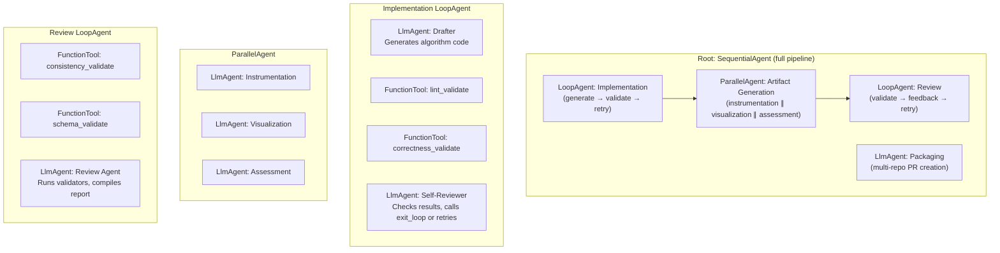
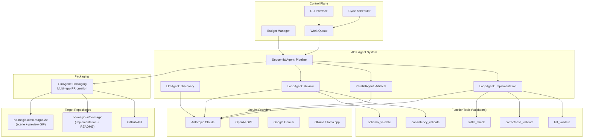
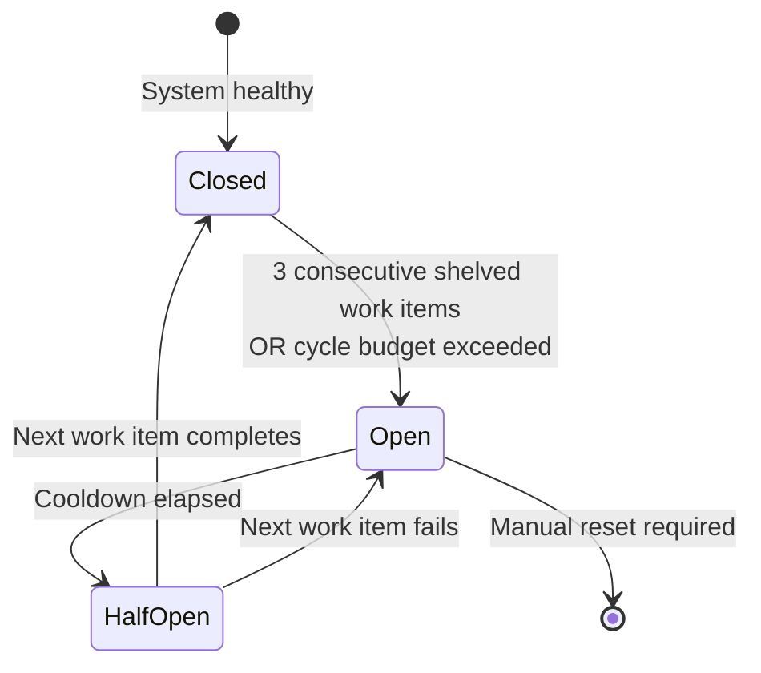
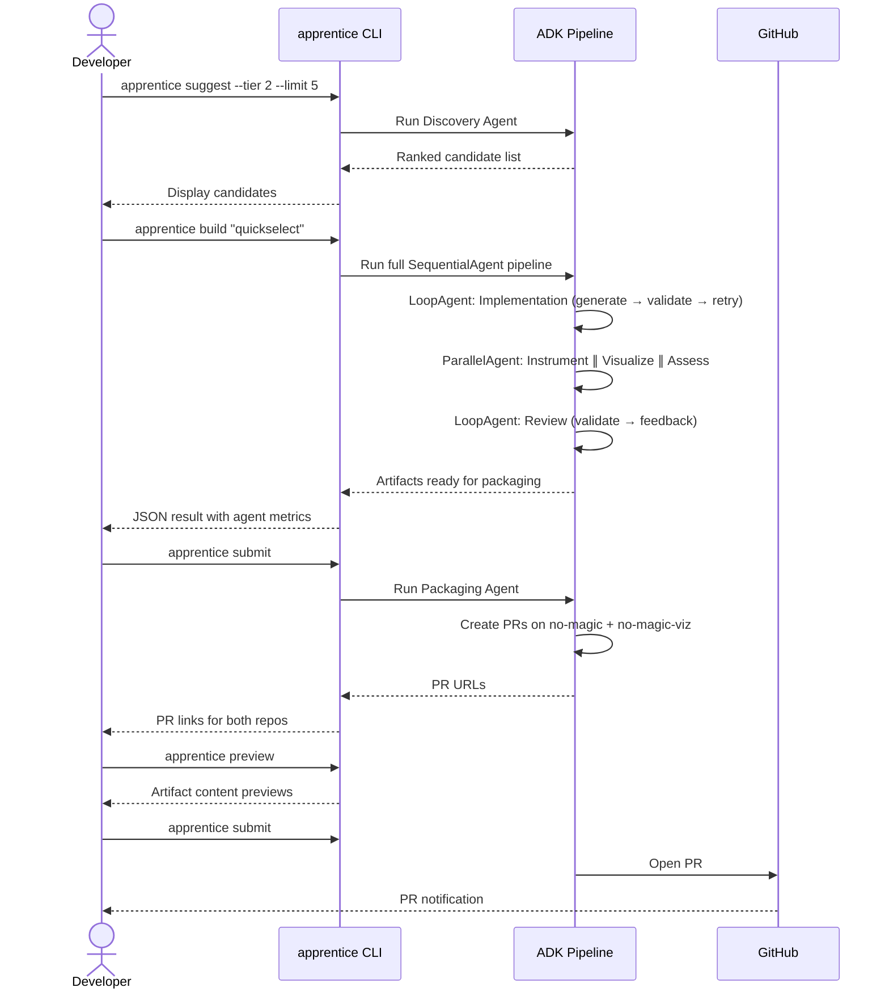
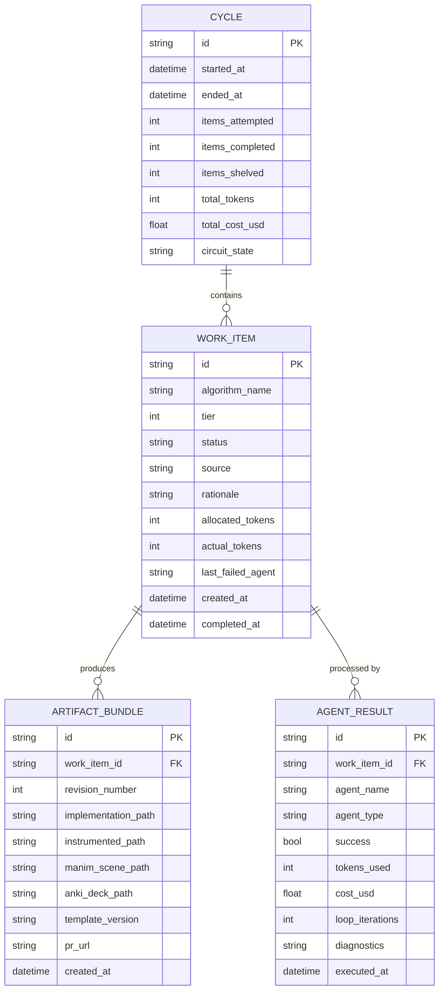

# apprentice — Multi-Agent Algorithm Factory for no-magic

> A multi-agent system built on Google ADK that implements, instruments, visualizes, tests, and ships new algorithm entries for the no-magic ecosystem. Specialist agents coordinate under an orchestrator to produce complete educational content — from algorithm selection through PR submission.

**Repository**: `no-magic-ai/apprentice`
**Parent ecosystem**: `no-magic-ai/no-magic`
**Framework**: [Google Agent Development Kit (ADK)](https://github.com/google/adk-python)

---

## 1. Naming Rationale

`apprentice` — a learner that produces work under supervision, gradually earning autonomy. Maps directly to the v1→v2 trajectory: assisted apprentice → autonomous apprentice with guardrails.

---

## 2. Problem Statement

no-magic currently has 47 algorithms across four tiers, each requiring artifacts across multiple repositories:

| Repository | Content | Example |
|---|---|---|
| `no-magic-ai/no-magic` | Single-file, zero-dependency Python implementation (`micro{name}.py`) | `01-foundations/microlstm.py` |
| `no-magic-ai/no-magic-viz` | Manim scene (`scene_micro{name}.py`) + preview GIF (`previews/micro{name}.gif`) | `scenes/scene_microlstm.py` |
| `no-magic-ai/no-magic` | Tier README update (add to algorithm table) | `01-foundations/README.md` |
| `no-magic-ai/no-magic` | Root README update (add GIF preview card) | `README.md` |
| `no-magic-ai/no-magic` | Learning path update (add to relevant tracks) | `LEARNING_PATH.md` |

Every new algorithm requires producing artifacts across at minimum **2 repositories** (`no-magic` + `no-magic-viz`), maintaining consistency with existing conventions, and validating correctness. This multi-repo coordination is the bottleneck to catalog growth.

**apprentice** automates the full artifact pipeline using a multi-agent system where specialist agents handle implementation, visualization, assessment, and review — coordinated by an ADK orchestrator that manages budget, sequencing, quality enforcement, and **cross-repo PR packaging**.

### 2.1 Target Repository Structure

```
no-magic-ai/no-magic/                     # Main algorithm repo
├── 01-foundations/                        # Tier 1: Core algorithms
│   ├── microgpt.py                       # Implementation (zero-dep, stdlib-only)
│   ├── microlstm.py
│   └── README.md                         # Tier-level catalog table
├── 02-alignment/                         # Tier 2: Training techniques
├── 03-systems/                           # Tier 3: Inference optimizations
├── 04-agents/                            # Tier 4: Agent algorithms
├── LEARNING_PATH.md                      # Cross-tier learning tracks
└── README.md                             # Root with GIF preview grid

no-magic-ai/no-magic-viz/                 # Visualization repo
├── scenes/
│   ├── scene_microgpt.py                 # Manim Scene subclass
│   └── scene_microlstm.py
├── previews/
│   ├── microgpt.gif                      # Rendered preview (referenced by no-magic README)
│   └── microlstm.gif
└── renders/                              # Full renders (optional)
```

### 2.2 Naming Convention

All algorithms follow the `micro{name}` pattern:
- Implementation: `micro{name}.py` in the tier directory
- Scene: `scene_micro{name}.py` in `no-magic-viz/scenes/`
- Preview: `micro{name}.gif` in `no-magic-viz/previews/`
- The `micro` prefix is mandatory — it's the project's identity

### 2.3 Tier Mapping

| Tier | Directory | Focus |
|---|---|---|
| 1 | `01-foundations/` | Core algorithms (GPT, RNN, tokenizer, embeddings, etc.) |
| 2 | `02-alignment/` | Training techniques (LoRA, DPO, PPO, MoE, etc.) |
| 3 | `03-systems/` | Inference optimizations (attention, KV-cache, quantization, etc.) |
| 4 | `04-agents/` | Agent algorithms (MCTS, bandit, minimax, etc.) |

---

## 3. Design Principles

| Principle | Implication |
|---|---|
| **Multi-agent by design** | Each specialist agent has a distinct role, instruction, tool access, and reasoning loop. Agent boundaries correspond to intuitive roles, not arbitrary splits. |
| **Honest agent boundaries** | Full agents use `LoopAgent` for self-correction. Tool-agents are single `LlmAgent` instances. Validators are `FunctionTool` wrappers. The tier matches the behavioral complexity. |
| **Framework over reinvention** | Google ADK provides `SequentialAgent`, `ParallelAgent`, `LoopAgent` — battle-tested orchestration primitives. No hand-rolled dispatch loops. |
| **Provider agnostic** | ADK's `LiteLlm` wrapper supports Anthropic (Claude), OpenAI (GPT), Google (Gemini), and local models (Ollama, llama.cpp). Switch providers via config, not code. |
| **Containment first** | Autonomous mode has hard budget caps, rate limits, and mandatory human checkpoints. Agents cannot escalate their own permissions. |
| **Artifact parity** | Agent-generated entries are structurally indistinguishable from hand-crafted ones. |
| **Prompt transparency** | All agent instructions are versioned and stored separately from agent logic. |
| **Explicit conventions** | Coupling to no-magic repo conventions is captured in a machine-readable schema. |

---

## 4. Multi-Agent Architecture (Google ADK)

### 4.1 Framework Choice

Google ADK is an open-source, code-first Python framework for building multi-agent systems. It provides:

- **`LlmAgent`** — wraps an LLM with instructions, tools, and session state
- **`SequentialAgent`** — runs sub-agents in order (pipeline)
- **`ParallelAgent`** — runs sub-agents concurrently
- **`LoopAgent`** — iterates sub-agents until exit condition or max iterations
- **`FunctionTool`** — wraps Python functions as agent-callable tools
- **Lifecycle callbacks** — `before_agent`, `after_agent`, `before_model`, `after_model` hooks
- **Session state** — shared state across agents via `output_key` / `{variable}` interpolation
- **Dev web UI** — built-in debugging interface (`adk web`)

**Multi-provider support via LiteLlm:**

```python
from google.adk.agents import Agent
from google.adk.models.lite_llm import LiteLlm

# Anthropic Claude (default)
agent = Agent(model=LiteLlm(model="anthropic/claude-sonnet-4-20250514"), ...)

# OpenAI GPT
agent = Agent(model=LiteLlm(model="openai/gpt-4.1"), ...)

# Google Gemini (native)
agent = Agent(model="gemini-2.5-flash", ...)

# Local Ollama
agent = Agent(model=LiteLlm(model="ollama_chat/llama3.3"), ...)

# Local llama.cpp (via OpenAI-compatible API)
agent = Agent(model=LiteLlm(model="openai/local-model"), ...)
# Requires: OPENAI_API_BASE=http://localhost:8080/v1
```

### 4.2 Agent Composition

The pipeline is expressed as a hierarchy of ADK agent types:



**Mapping to ADK primitives:**

| apprentice concept | ADK primitive | Why |
|---|---|---|
| Full pipeline | `SequentialAgent` | Stages run in defined order |
| Implementation with self-correction | `LoopAgent(max_iterations=3)` | Drafter + self-reviewer iterate until pass or exhaustion |
| Parallel artifact generation | `ParallelAgent` | Instrumentation, visualization, assessment are independent |
| Review with validation | `LoopAgent(max_iterations=2)` | Review agent validates, provides feedback, may retry |
| Multi-repo packaging | `LlmAgent` with GitHub tools | Creates coordinated PRs across `no-magic` + `no-magic-viz` |
| Validators (lint, correctness, etc.) | `FunctionTool` | Pure functions called as agent tools |
| Discovery (standalone) | `LlmAgent` with catalog tools | Multi-step reasoning with dedup tools |
| Budget tracking | `before_agent_callback` / `after_agent_callback` | Hooks track tokens and cost per agent |

### 4.3 High-Level Architecture



### 4.4 Agent Execution Flow

```mermaid
sequenceDiagram
    participant Pipe as SequentialAgent
    participant Impl as LoopAgent (Implementation)
    participant Draft as LlmAgent (Drafter)
    participant Lint as FunctionTool (lint)
    participant Correct as FunctionTool (correctness)
    participant Par as ParallelAgent
    participant Instr as LlmAgent (Instrumentation)
    participant Viz as LlmAgent (Visualization)
    participant Assess as LlmAgent (Assessment)
    participant Rev as LoopAgent (Review)

    Pipe->>Impl: Execute implementation loop

    loop max_iterations=3
        Impl->>Draft: Generate code
        Draft->>Lint: lint_validate(code)
        Lint-->>Draft: ValidationResult
        Draft->>Correct: correctness_validate(code)
        Correct-->>Draft: ValidationResult
        alt All pass
            Draft->>Draft: exit_loop
        else Failure
            Draft->>Draft: Re-prompt with suggestions
        end
    end

    Impl-->>Pipe: Implementation artifact

    Pipe->>Par: Fan-out artifact generation
    par Concurrent
        Par->>Instr: Add trace hooks
        Par->>Viz: Generate Manim scene
        Par->>Assess: Generate Anki cards
    end
    Par-->>Pipe: All artifacts

    Pipe->>Rev: Review all artifacts
    loop max_iterations=2
        Rev->>Rev: Run consistency + schema validators
        alt Pass
            Rev->>Rev: exit_loop
        else Fail
            Rev->>Rev: Compile feedback
        end
    end
    Rev-->>Pipe: Review verdict

    Pipe->>Pkg: Package artifacts
    participant Pkg as LlmAgent (Packaging)
    participant GH as GitHub API

    Pkg->>Pkg: Place implementation in no-magic/{tier_dir}/
    Pkg->>Pkg: Place scene in no-magic-viz/scenes/
    Pkg->>Pkg: Render preview GIF to no-magic-viz/previews/
    Pkg->>Pkg: Update tier README + root README + LEARNING_PATH
    Pkg->>GH: Create branch + PR on no-magic
    Pkg->>GH: Create branch + PR on no-magic-viz
    Pkg->>GH: Cross-reference PRs in descriptions
    Pkg-->>Pipe: PR URLs
```

### 4.5 Provider Configuration

All agents use `LiteLlm` for provider-agnostic model access. The provider is selected via `config/apprentice.toml`:

```toml
[provider]
backend = "anthropic"                          # anthropic | openai | gemini | ollama | local
model = "anthropic/claude-sonnet-4-20250514"   # LiteLlm model string
fallback_model = "anthropic/claude-haiku-4-5-20251001"
local_api_base = "http://localhost:11434"       # For ollama/llama.cpp
```

**Local model support:**

| Backend | Config | Requirements |
|---|---|---|
| Ollama | `model = "ollama_chat/llama3.3"`, `local_api_base = "http://localhost:11434"` | Ollama running locally |
| llama.cpp server | `model = "openai/local-model"`, `local_api_base = "http://localhost:8080/v1"` | llama-server running with `--host 0.0.0.0` |
| Any OpenAI-compatible | `model = "openai/<model-name>"`, `local_api_base = "http://host:port/v1"` | Server exposing OpenAI-compatible API |

Environment variables for local models:
```bash
# Ollama
export OLLAMA_API_BASE=http://localhost:11434

# llama.cpp / local OpenAI-compatible
export OPENAI_API_BASE=http://localhost:8080/v1
export OPENAI_API_KEY=not-needed   # Required by LiteLlm but unused locally
```

### 4.6 Component Breakdown

```mermaid
graph LR
    subgraph apprentice
        direction TB
        A[core/] --> A1[orchestrator.py<br/>ADK SequentialAgent pipeline builder]
        A --> A2[budget.py<br/>Token & cost tracking via callbacks]
        A --> A3[queue.py<br/>Work item management]
        A --> A4[observability.py<br/>Logging, metrics, alerts]

        B[agents/] --> B1[discovery.py<br/>LlmAgent with catalog tools]
        B --> B2[implementation.py<br/>LoopAgent: drafter + self-reviewer]
        B --> B3[instrumentation.py<br/>LlmAgent: trace hook injection]
        B --> B4[visualization.py<br/>LlmAgent: Manim scene generation]
        B --> B5[assessment.py<br/>LlmAgent: Anki card generation]
        B --> B6[review.py<br/>LoopAgent: validator + feedback]
        B --> B7[packaging.py<br/>LlmAgent: multi-repo PR creation]

        C[validators/] --> C1[lint.py → FunctionTool]
        C --> C2[correctness.py → FunctionTool]
        C --> C3[consistency.py → FunctionTool]
        C --> C4[schema_compliance.py → FunctionTool]

        D[providers/] --> D1[factory.py<br/>LiteLlm model factory]

        E[config/] --> E1[apprentice.toml]
        E --> E2[catalog.toml]
        E --> E3[no-magic-schema.yaml]
        E --> E4[templates/]
    end
```



---

## 5. Agent Specifications

### 5.1 Discovery Agent — `LlmAgent`

**ADK type**: `LlmAgent` with `FunctionTool`s for catalog access and dedup

**Instruction**: Analyze the no-magic catalog, identify tier gaps, suggest candidate algorithms, deduplicate against existing entries.

**Tools**:
- `load_catalog()` — reads `catalog.toml`, returns existing algorithms with aliases
- `check_duplicate(name, existing)` — Levenshtein similarity check (≥0.85 threshold)
- `validate_name(name)` — checks `[a-z0-9_]` whitelist

**Session state output**: `discovery_candidates` — JSON list of non-duplicate candidates

### 5.2 Implementation Agent — `LoopAgent`

**ADK type**: `LoopAgent(max_iterations=3)` containing:
1. `LlmAgent("drafter")` — generates stdlib-only Python implementation
2. `LlmAgent("self_reviewer")` — runs `lint_validate` and `correctness_validate` tools, calls `exit_loop` on pass or re-prompts drafter on failure

**Tools** (available to self_reviewer):
- `lint_validate(code_path)` → `FunctionTool` wrapping `LintValidator`
- `correctness_validate(code_path)` → `FunctionTool` wrapping `CorrectnessValidator`
- `stdlib_check(code_path)` → `FunctionTool` wrapping AST import analysis
- `exit_loop` — ADK built-in, signals loop completion

**Session state output**: `implementation_path` — path to validated implementation file

### 5.3 Instrumentation Agent — `LlmAgent`

**ADK type**: Single `LlmAgent` (tool-agent, no self-correction)

**Instruction**: Add JSON trace hooks (`step`, `operation`, `state`) at algorithmic decision points.

**Input**: `{implementation_path}` from session state
**Output**: `instrumented_path` in session state

### 5.4 Visualization Agent — `LlmAgent`

**ADK type**: Single `LlmAgent` (tool-agent)

**Instruction**: Generate Manim animation steps for the scaffold template. Output only the animation sequence, not the full Scene class.

**Tools**: `load_template()` — reads `manim_scene.py.j2` scaffold
**Input**: `{implementation_path}` from session state
**Output**: `manim_scene_path` in session state

### 5.5 Assessment Agent — `LlmAgent`

**ADK type**: Single `LlmAgent` (tool-agent)

**Instruction**: Generate Anki flashcard CSV with 4 card types (concept, complexity, implementation, comparison), minimum 8 cards.

**Input**: `{implementation_path}` from session state
**Output**: `anki_deck_path` in session state

### 5.6 Review Agent — `LoopAgent`

**ADK type**: `LoopAgent(max_iterations=2)` containing:
1. `LlmAgent("reviewer")` — runs `consistency_validate` and `schema_validate` tools on all artifacts, compiles structured feedback, calls `exit_loop` on pass

**Tools**:
- `consistency_validate(artifacts)` → `FunctionTool` wrapping `ConsistencyValidator`
- `schema_validate(artifacts)` → `FunctionTool` wrapping `SchemaComplianceValidator`
- `exit_loop` — ADK built-in

**Session state output**: `review_verdict` — pass/fail with per-artifact diagnostics

### 5.7 Packaging Agent — `LlmAgent`

**ADK type**: Single `LlmAgent` with file management and GitHub `FunctionTool`s

**Goal**: Create coordinated PRs across `no-magic` and `no-magic-viz` repositories.

**Execution flow**:
1. Read all artifact paths from session state (`implementation_path`, `manim_scene_path`, `anki_deck_path`, etc.)
2. Clone/checkout both target repos (or use existing local clones)
3. Create a feature branch with the same name in both repos (`feat/micro{algorithm}`)
4. Place artifacts in correct locations:
   - `micro{name}.py` → `no-magic/{tier_dir}/`
   - `scene_micro{name}.py` → `no-magic-viz/scenes/`
   - `micro{name}.gif` (rendered preview) → `no-magic-viz/previews/`
5. Update documentation files in `no-magic`:
   - `{tier_dir}/README.md` — add row to algorithm table
   - `README.md` (root) — add GIF preview card to the tier section
   - `LEARNING_PATH.md` — add to relevant learning tracks
6. Open PR on `no-magic` with algorithm description and artifact checklist
7. Open PR on `no-magic-viz` with scene description
8. Cross-reference PRs in descriptions: "Companion PR: no-magic-ai/no-magic-viz#N"

**Tools**:
- `clone_repo(org, repo)` → `FunctionTool` that clones a GitHub repo
- `create_branch(repo_path, branch_name)` → `FunctionTool` for git branch operations
- `place_file(source, dest)` → `FunctionTool` to copy artifact to repo
- `open_pr(repo, branch, title, body)` → `FunctionTool` wrapping `gh pr create`
- `render_preview(scene_path)` → `FunctionTool` for headless Manim render to GIF

**Session state output**: `pr_urls` — dict with `{"no-magic": url, "no-magic-viz": url}`

**Human review gate**: Both PRs require human approval. The agent **cannot merge** — tokens are scoped to `pull_request: write` only.

---

## 6. Validators as FunctionTools

Validators are pure Python functions wrapped with ADK's `FunctionTool`. Agents call them as tools during their execution — the LLM decides when to invoke validation based on its instruction.

```python
from google.adk.tools import FunctionTool

def lint_validate(code_path: str) -> dict:
    """Validate Python code for syntax, docstrings, type annotations, and style."""
    result = LintValidator().validate({"implementation": code_path}, work_item)
    return result.to_dict()

lint_tool = FunctionTool(func=lint_validate)
```

| Validator | Tool Name | Returns |
|---|---|---|
| Lint | `lint_validate` | Issues with suggestions: "Add type annotations to 'foo'" |
| Correctness | `correctness_validate` | Pass/fail with stderr excerpt |
| Consistency | `consistency_validate` | Cross-artifact name/complexity match |
| Schema Compliance | `schema_validate` | Convention conformance per `no-magic-schema.yaml` |

---

## 7. Containment System

### 7.1 Budget Manager (via ADK Callbacks)

Budget tracking uses ADK lifecycle callbacks rather than manual accounting:

```python
async def before_agent_budget_check(callback_context: CallbackContext):
    """Reject execution if budget exhausted."""
    remaining = callback_context.state.get("budget_remaining_tokens", 0)
    if remaining <= 0:
        return types.Content(parts=[types.Part(text="Budget exhausted.")])
    return None

async def after_agent_track_cost(callback_context: CallbackContext):
    """Deduct actual usage from remaining budget."""
    tokens = callback_context.state.get("last_tokens_used", 0)
    remaining = callback_context.state.get("budget_remaining_tokens", 0)
    callback_context.state["budget_remaining_tokens"] = remaining - tokens
    return None
```

**Four-level hierarchy**: Global → Cycle → Work Item → Agent.

### 7.2 Rate Limiting

| Limit | Default | Configurable |
|---|---|---|
| Max PRs per day | 2 | Yes |
| Max PRs per week | 5 | Yes |
| Max algorithms per cycle | 3 | Yes |
| Max concurrent work items | 1 | Yes |
| Cooldown between cycles | 4 hours | Yes |
| Max implementation loop iterations | 3 | No (hard cap) |
| Max review loop iterations | 2 | No (hard cap) |

### 7.3 Circuit Breaker



### 7.4 Input Sanitization

| Input Source | Sanitization |
|---|---|
| Algorithm names | Whitelist: `[a-z0-9_]`, max 64 chars |
| GitHub issue descriptions | Strip prompt control sequences before agent context |
| PR review comments | Parsed for actionable feedback only |
| Inter-agent state | ADK session state — structured, no free-form injection |

---

## 8. User Workflow — Assisted Mode (v1)



### CLI Commands

```
apprentice suggest [--tier N] [--limit N]     # Discovery Agent
apprentice build <algorithm>                   # Full ADK pipeline
apprentice build --from-issue <issue-number>   # Build from GitHub issue
apprentice preview                             # Inspect last build artifacts
apprentice submit                              # Package and open PR
apprentice status                              # Budget usage, queue state
apprentice metrics [--last-7d]                 # Per-agent cost breakdown
apprentice retry <work-item-id>                # Retry shelved item
apprentice reset-circuit                       # Manual circuit breaker reset
apprentice config                              # View/edit apprentice.toml
```

---

## 9. Configuration — `apprentice.toml`

```toml
[provider]
backend = "anthropic"
model = "anthropic/claude-sonnet-4-20250514"
fallback_model = "anthropic/claude-haiku-4-5-20251001"
fallback_trigger = "budget_warning"
local_api_base = ""                            # Set for ollama/llama.cpp

[budget.global]
monthly_token_ceiling = 2_000_000
monthly_cost_ceiling_usd = 50.0

[budget.cycle]
max_tokens_per_cycle = 100_000
max_cost_per_cycle_usd = 5.0
max_algorithms_per_cycle = 3

[budget.agent]
max_tokens_per_agent_call = 20_000
implementation_budget_pct = 40
tool_agent_budget_pct = 15
review_budget_pct = 15

[agents]
max_implementation_retries = 3
max_review_rounds = 2
max_tool_agent_retries = 1

[rate_limits]
max_prs_per_day = 2
max_prs_per_week = 5
max_concurrent_items = 1
cooldown_hours = 4
max_files_per_pr = 10
max_lines_per_pr = 2000

[circuit_breaker]
failure_threshold = 3
half_open_probe_after_minutes = 60
max_open_cycles_before_manual_reset = 3

[observability]
log_level = "INFO"
log_format = "json"
log_path = "${HOME}/.apprentice/logs"
metrics_enabled = true
alert_on_circuit_open = true
alert_webhook = ""

[templates]
version = "1.0.0"
base_path = "config/templates"
```

---

## 10. Data Model

### 10.1 Entity Relationships



---

## 11. Version Roadmap

| Version | Scope | Mode |
|---|---|---|
| **v0.1** | CLI scaffold, provider interface, single-stage implementation | Assisted only |
| **v0.2** | Full pipeline (all stages), quality gates | Assisted only |
| **v0.3** | Agent foundation: custom orchestrator, implementation agent, validators | Assisted only |
| **v0.4** | ADK migration: replace custom orchestrator with ADK primitives, all agents, local LLM support | Assisted only |
| **v1.0** | Stable assisted mode, ≥95% success rate | **Assisted — release** |
| **v1.1** | Scheduler, work queue, cycle management | Autonomous foundations |
| **v1.2** | Circuit breaker, rate limiting, full containment | Autonomous safeguards |
| **v1.3** | Discovery Agent (autonomous candidate selection) | Autonomous discovery |
| **v1.4** | Observability: agent metrics, cost dashboard, alerting | Autonomous monitoring |
| **v2.0** | Full autonomous mode. Read-only launch (opens PRs, human merges). | **Autonomous — release** |
| **v2.1** | Review Agent feedback loop (revises from PR review comments) | Autonomous refinement |

---

## 12. Repository Structure

```
no-magic-ai/apprentice/
├── src/
│   └── apprentice/
│       ├── __init__.py
│       ├── cli.py                    # CLI entry point
│       ├── core/
│       │   ├── orchestrator.py       # ADK pipeline builder (SequentialAgent)
│       │   ├── budget.py             # Budget callbacks for ADK agents
│       │   ├── queue.py              # Work item management
│       │   ├── circuit_breaker.py    # Failure containment
│       │   ├── scheduler.py          # Autonomous cycle scheduling
│       │   └── observability.py      # Structured logging, metrics
│       ├── agents/
│       │   ├── base.py               # Shared agent helpers
│       │   ├── discovery.py          # LlmAgent with catalog tools
│       │   ├── implementation.py     # LoopAgent: drafter + self-reviewer
│       │   ├── instrumentation.py    # LlmAgent (tool-agent)
│       │   ├── visualization.py      # LlmAgent (tool-agent)
│       │   ├── assessment.py         # LlmAgent (tool-agent)
│       │   ├── review.py             # LoopAgent: validator + feedback
│       │   └── packaging.py         # LlmAgent: multi-repo PR creation
│       ├── validators/
│       │   ├── base.py               # ValidationResult, ValidationIssue
│       │   ├── lint.py               # → FunctionTool
│       │   ├── correctness.py        # → FunctionTool
│       │   ├── consistency.py        # → FunctionTool
│       │   └── schema_compliance.py  # → FunctionTool
│       ├── providers/
│       │   └── factory.py            # LiteLlm model factory
│       ├── prompts/                  # Agent instructions (YAML)
│       └── models/                   # WorkItem, ArtifactBundle, etc.
├── config/
│   ├── apprentice.toml
│   ├── catalog.toml
│   ├── no-magic-schema.yaml
│   └── templates/
│       └── manim_scene.py.j2
├── tests/
├── pyproject.toml
├── README.md
└── LICENSE
```

---

## 13. Open Design Questions

| # | Question | Decision |
|---|---|---|
| 1 | State persistence | **SQLite** — queryable budget history, transaction safety. |
| 2 | Template engine | **Jinja2** — one dependency, massive complexity reduction. |
| 3 | Manim validation | **Headless render** — AST can't catch runtime errors. |
| 4 | Anki export format | **CSV for v1.0**, `.apkg` as enhancement. |
| 5 | Autonomous trigger | **GitHub Actions** — runs where the repo lives. |

### Remaining Open Questions

| # | Question | Context |
|---|---|---|
| 6 | ADK session persistence | ADK supports `InMemorySessionService` and custom backends. Use SQLite-backed session for durable state across runs? |
| 7 | ADK dev web UI deployment | Run `adk web` locally during development. How to integrate with CI? |
| 8 | Local model quality threshold | Ollama/llama.cpp models produce lower quality than Claude. Should validators be stricter for local models? |
| 9 | ADK version pinning | ADK is rapidly evolving. Pin to specific version and test before upgrading? |
| 10 | Legacy code removal | When to remove `stages/`, `gates/`, custom `Pipeline`? After v1.0 stabilization. |
