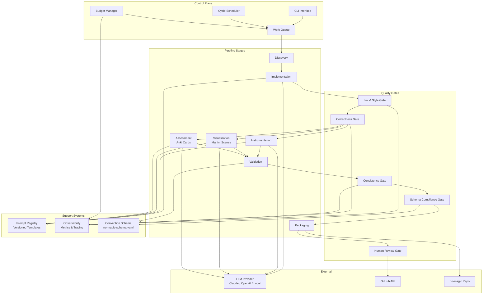
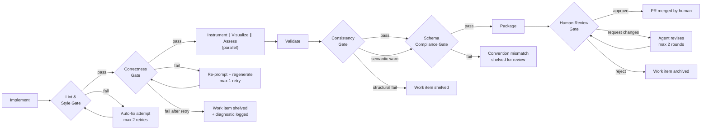
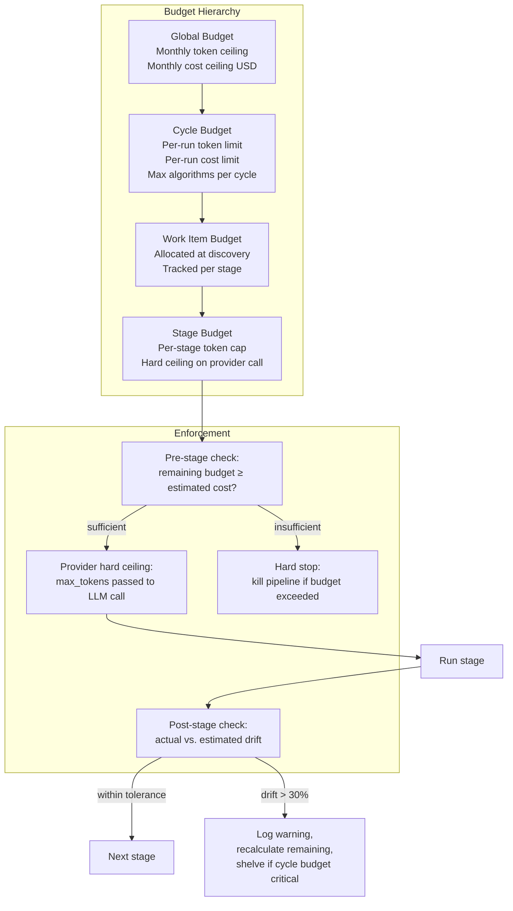
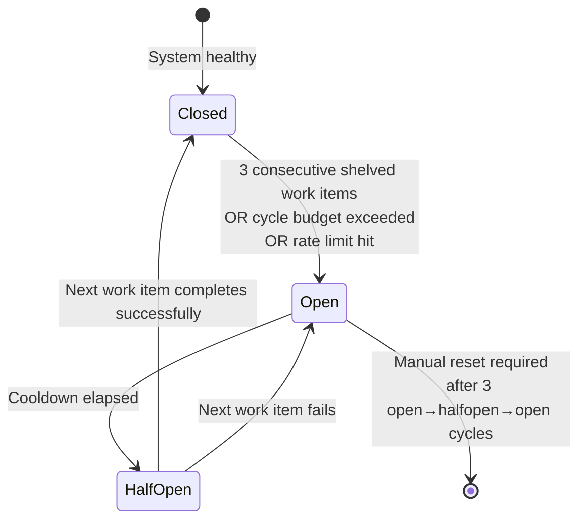
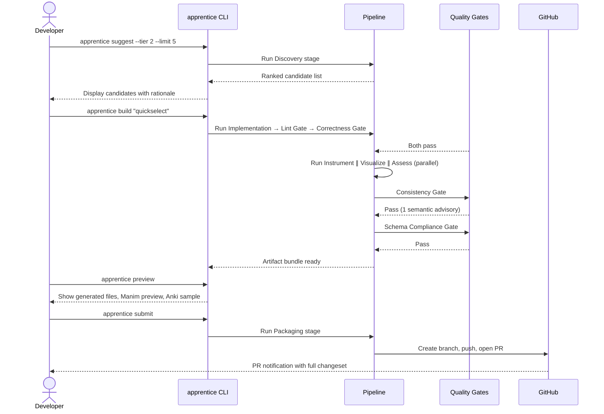
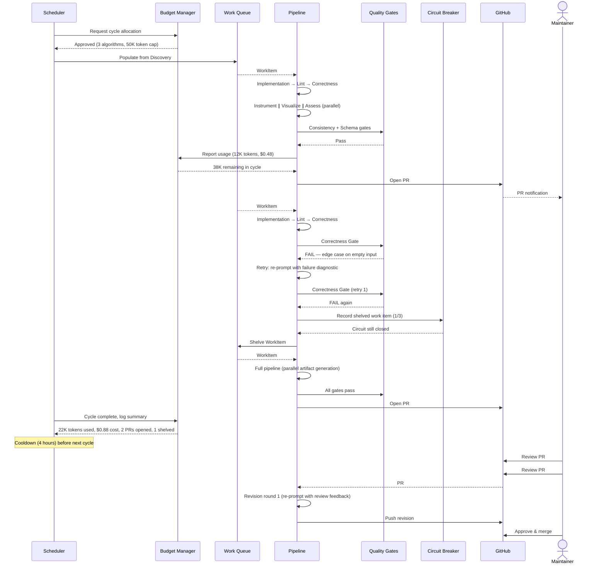
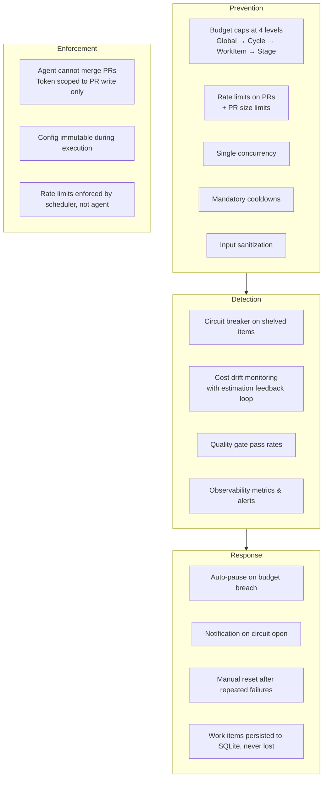
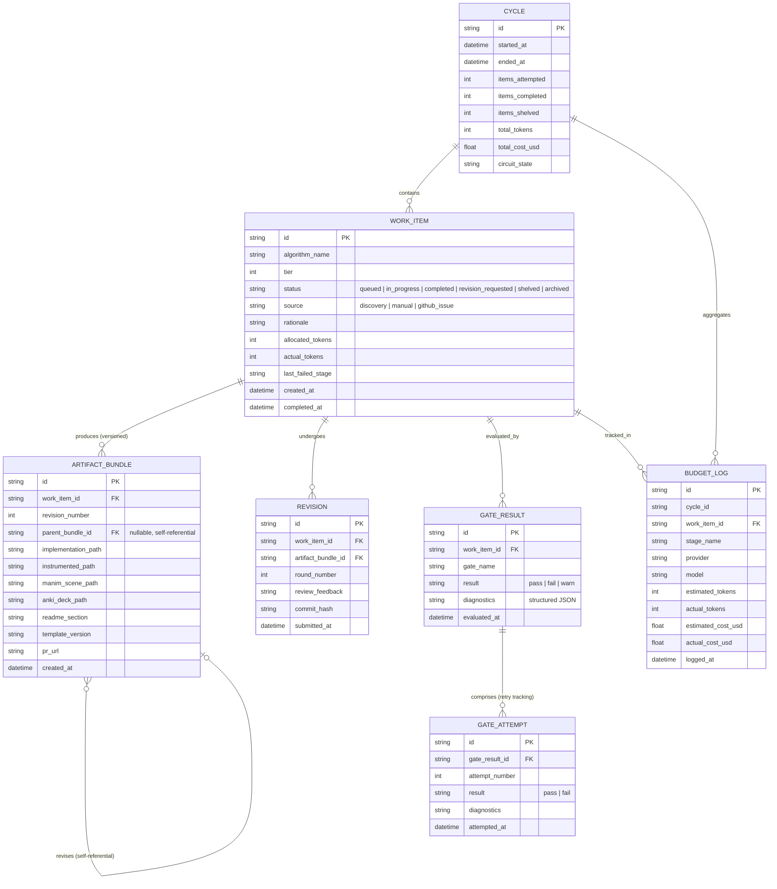
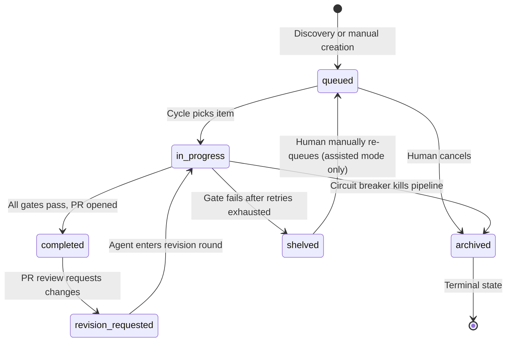

# apprentice — Agentic Algorithm Factory for no-magic

> An agent that implements, instruments, visualizes, tests, and ships new algorithm entries for the no-magic ecosystem. Designed for autonomy from day one, delivered incrementally.

**Repository**: `no-magic-ai/apprentice`
**Parent ecosystem**: `no-magic-ai/no-magic`

---

## 1. Naming Rationale

`apprentice` — a learner that produces work under supervision, gradually earning autonomy. No abstraction, no mysticism. Maps directly to the v1→v2 trajectory: assisted apprentice → autonomous apprentice with guardrails. Stays in the `no-magic` register where everything is named for what it literally does.

---

## 2. Problem Statement

no-magic currently has 41 algorithms across four tiers, each with:

- Single-file, zero-dependency Python implementation
- Manim animation for visual explanation
- Anki flashcard deck
- Learning track placement
- README documentation

Every new algorithm requires manually producing all five artifacts, maintaining consistency with existing conventions, and validating correctness. This is the bottleneck to catalog growth.

**apprentice** automates the full artifact pipeline — from algorithm selection through PR submission — with containment mechanisms that prevent runaway cost, token usage, and PR flooding.

---

## 3. Design Principles

| Principle                | Implication                                                                                                                                                                                                 |
| ------------------------ | ----------------------------------------------------------------------------------------------------------------------------------------------------------------------------------------------------------- |
| **No magic**             | Every agent decision is logged and explainable. No black-box orchestration.                                                                                                                                 |
| **Containment first**    | Autonomous mode has hard budget caps, rate limits, and mandatory human checkpoints.                                                                                                                         |
| **Artifact parity**      | Agent-generated entries are structurally indistinguishable from hand-crafted ones.                                                                                                                          |
| **Provider agnostic**    | LLM calls go through a thin provider interface. No vendor lock-in.                                                                                                                                          |
| **Prompt transparency**  | All prompts are versioned, templated, and stored separately from stage logic. Prompt changes are tracked like code changes.                                                                                 |
| **Thin orchestration**   | Pipeline coordination is config-driven. The sequencer reads stage ordering from configuration rather than hardcoding control flow. Stages are self-contained modules that declare their inputs and outputs. |
| **Explicit conventions** | Coupling to no-magic repo conventions is captured in a machine-readable schema, not implied by code.                                                                                                        |

---

## 4. System Architecture

### 4.1 High-Level Architecture



**Pipeline flow**: After Implementation passes Lint and Correctness gates, Instrumentation, Visualization, and Assessment run **in parallel** (they are functionally independent). All three must complete before Validation runs the integration checks.

### 4.2 Component Breakdown

```mermaid
graph LR
    subgraph apprentice
        direction TB
        A[core/] --> A1[pipeline.py<br/>Config-driven stage sequencer]
        A --> A2[budget.py<br/>Token & cost tracking]
        A --> A3[queue.py<br/>Work item management]
        A --> A4[observability.py<br/>Logging, metrics, alerts]

        B[stages/] --> B1[base.py<br/>Stage interface contract]
        B --> B2[discovery.py]
        B --> B3[implementation.py]
        B --> B4[instrumentation.py]
        B --> B5[visualization.py]
        B --> B6[assessment.py]
        B --> B7[validation.py]
        B --> B8[packaging.py]

        C[gates/] --> C1[base.py<br/>Gate interface contract]
        C --> C2[lint.py]
        C --> C3[correctness.py]
        C --> C4[consistency.py]
        C --> C5[schema_compliance.py]
        C --> C6[review.py]

        D[providers/] --> D1[base.py<br/>Provider interface]
        D --> D2[anthropic.py]
        D --> D3[openai.py]

        E[prompts/] --> E1[discovery.yaml]
        E --> E2[implementation.yaml]
        E --> E3[instrumentation.yaml]
        E --> E4[visualization.yaml]
        E --> E5[assessment.yaml]

        F[config/] --> F1[apprentice.toml<br/>All runtime config]
        F --> F2[catalog.toml<br/>Algorithm registry]
        F --> F3[no-magic-schema.yaml<br/>Convention schema]
        F --> F4[templates/<br/>Artifact Jinja2 templates]
    end
```



### 4.3 Interface Contracts

#### Stage Interface

Every pipeline stage implements `StageInterface`:

```python
class StageInterface(Protocol):
    """Contract for all pipeline stages."""

    name: str
    estimated_tokens: int  # Pre-execution estimate for budget checks

    def execute(self, work_item: WorkItem, context: PipelineContext) -> StageResult:
        """Run the stage. Must be idempotent — safe to retry on the same input."""
        ...

    def estimate_cost(self, work_item: WorkItem) -> CostEstimate:
        """Return token/cost estimate before execution."""
        ...
```

`StageResult` contains:

- `artifacts`: dict of output paths
- `tokens_used`: actual token consumption
- `diagnostics`: structured log of decisions made

Stages receive a `WorkItem` and return a new `StageResult` — they never mutate the `WorkItem` directly.

#### Gate Interface

Every quality gate implements `GateInterface`:

```python
class GateInterface(Protocol):
    """Contract for all quality gates."""

    name: str
    max_retries: int  # 0 = hard fail, >0 = auto-fix allowed
    blocking: bool     # True = blocks pipeline, False = advisory

    def evaluate(self, work_item: WorkItem, artifacts: ArtifactBundle) -> GateResult:
        """Evaluate artifacts against gate criteria."""
        ...
```

`GateResult` contains:

- `verdict`: `pass | fail | warn`
- `diagnostics`: structured report (JSON) with specific failure reasons
- `auto_fixable`: bool — whether the gate can attempt a fix
- `fix_suggestion`: optional structured fix hint for retry

#### Provider Interface

```python
class ProviderInterface(Protocol):
    """Contract for LLM providers."""

    def complete(self, prompt: PromptTemplate, context: dict, max_tokens: int) -> Completion:
        """Generate completion with hard token ceiling."""
        ...

    def estimate_tokens(self, prompt: PromptTemplate, context: dict) -> int:
        """Estimate total tokens (input + output) for budget pre-checks."""
        ...

    def cost_per_token(self, direction: Literal["input", "output"]) -> float:
        """Return USD cost per token for the active model."""
        ...
```

The `max_tokens` parameter on `complete()` enforces a hard ceiling — the provider kills the response if tokens exceed the remaining stage budget. This prevents mid-call budget overruns.

---

## 5. Pipeline Stages — Detail

### 5.1 Discovery

**Input**: Algorithm catalog (existing) + tier definitions + domain taxonomy
**Output**: Ranked list of candidate algorithms with justification

| Aspect               | Detail                                                                                                                               |
| -------------------- | ------------------------------------------------------------------------------------------------------------------------------------ |
| Source of candidates | Tier gap analysis, textbook indices, prerequisite graphs, community requests (GitHub issues labeled `algorithm-request`)             |
| Ranking criteria     | Prerequisite coverage (dependencies already in catalog), pedagogical value, tier balance, community demand                           |
| Deduplication        | Fuzzy match against existing implementations (Levenshtein distance + alias normalization, threshold ≥ 0.85 rejects candidate)        |
| Input sanitization   | Algorithm names validated against `[a-z0-9_]` whitelist. Issue descriptions stripped of prompt control sequences before LLM context. |
| Output format        | `WorkItem` with algorithm name, tier, rationale, estimated complexity, prerequisite list, allocated token budget                     |

In **assisted mode**, discovery presents the ranked list for human selection.
In **autonomous mode**, discovery picks the top-N candidates constrained by the cycle budget.

### 5.2 Implementation

**Input**: `WorkItem` with algorithm specification
**Output**: Single-file Python implementation following no-magic conventions

The implementation stage:

1. Retrieves 2-3 existing implementations from the same tier as style references
2. Loads the versioned prompt template from `prompts/implementation.yaml`
3. Generates the implementation with type hints, docstrings, and inline comments
4. Ensures zero external dependencies (stdlib only, verified via AST import analysis)
5. Produces reference test cases with known inputs/outputs

### 5.3 Instrumentation

**Input**: Raw implementation (must pass Lint and Correctness gates first)
**Output**: Instrumented implementation with step-by-step trace logging

Adds trace hooks at decision points — comparisons, swaps, splits, merges, gradient steps — so learners can replay execution. The trace format must match the convention defined in `config/no-magic-schema.yaml`.

**Runs in parallel** with Visualization and Assessment after Correctness gate passes.

### 5.4 Visualization (Manim)

**Input**: Algorithm implementation + instrumentation trace data
**Output**: Manim scene file (.py) that animates the algorithm

Generates a Manim `Scene` subclass using a **scaffolded template approach**:

1. Retrieve a style-matched reference animation from the same tier as few-shot example
2. Extract configuration (color palette, animation speeds, canvas layout) from the reference
3. Load the Manim scaffold template with pre-defined helper methods (`_setup_array`, `_animate_comparison`, `_animate_swap`, etc.)
4. LLM generates only the animation sequence and data structure setup — not the entire Scene class
5. Assemble the complete scene from scaffold + generated sequence

This constrained generation reduces hallucination risk compared to open-ended Manim code generation.

**Dependency**: Requires instrumentation trace data from §5.3 when available. If running in parallel, uses the raw implementation's structure to infer animation steps; trace data refines the animation in a post-pass if Instrumentation completes first.

**Runs in parallel** with Instrumentation and Assessment after Correctness gate passes.

### 5.5 Assessment (Anki)

**Input**: Algorithm implementation + documentation
**Output**: Anki-compatible flashcard deck

Card types:

- Concept cards (what does this algorithm do, when to use it)
- Complexity cards (time/space, best/worst/average)
- Implementation cards (key code patterns, edge cases)
- Comparison cards (vs. related algorithms in the same tier)

**Runs in parallel** with Instrumentation and Visualization after Correctness gate passes.

### 5.6 Validation

**Input**: All generated artifacts (waits for parallel stages to complete)
**Output**: Pass/fail with diagnostics

| Check                    | Method                                                                                                                                                                                                                                             |
| ------------------------ | -------------------------------------------------------------------------------------------------------------------------------------------------------------------------------------------------------------------------------------------------- |
| Correctness              | Run implementation against reference inputs, compare outputs                                                                                                                                                                                       |
| Complexity documentation | Verify complexity claims are present and well-formed in docstring and README section (empirical Big-O verification deferred to human review — automated measurement is unreliable due to noise, constant factors, and input generation challenges) |
| Manim render             | Headless render: verify no exceptions, check duration (1s–60s), verify ≥50% canvas utilization, confirm frame changes (not static)                                                                                                                 |
| Anki format              | Schema validation against Anki export format                                                                                                                                                                                                       |
| Style conformance        | AST comparison against existing implementations for structural patterns                                                                                                                                                                            |
| Trace format             | Verify instrumentation trace output matches `no-magic-schema.yaml` trace specification                                                                                                                                                             |

### 5.7 Packaging

**Input**: Validated artifact bundle
**Output**: Git branch + PR-ready changeset

- Places files in correct directory structure (resolved from `no-magic-schema.yaml`)
- Updates catalog index / README
- Generates PR description with algorithm summary, tier placement rationale, artifact checklist, and template version used
- Attaches rendered animation preview (GIF) to PR

---

## 6. Quality Gates

Gates sit between pipeline stages and enforce hard requirements. A gate failure halts the pipeline for that work item unless retries are available.



**Lint & Style Gate**: ruff + structural checks. Auto-fix allowed, max 2 retries.

**Correctness Gate**: Runs implementation against reference test cases. Allows 1 retry with re-prompting (the LLM can analyze the failure diagnostic and regenerate). Hard fail after retry — shelve and log.

**Consistency Gate**: Validates cross-artifact consistency with two tiers:

- **Structural checks** (deterministic, blocking): Algorithm name matches across all artifacts. Input/output signatures match between implementation, README, and Anki cards. Time/space complexity claims are consistent across all artifacts.
- **Semantic checks** (LLM-based, advisory): Pedagogical tone is consistent. Examples and use cases do not contradict. Advisory warnings are logged to PR description but do not block packaging.

**Schema Compliance Gate**: Validates all artifacts against `no-magic-schema.yaml` — directory placement, file naming, docstring format, trace format, required metadata fields. Fails on any convention mismatch.

**Human Review Gate**: Always required. The agent **cannot merge PRs** — the review gate sets `merge_approved = false` by default. Only a human maintainer with write access can merge. The agent's GitHub token is scoped to `pull_request: write` without `contents: write` on the default branch, making self-merge impossible at the API level.

### Gate Retry Summary

| Gate                     | Max Retries | Strategy                               | Failure Action          |
| ------------------------ | ----------- | -------------------------------------- | ----------------------- |
| Lint & Style             | 2           | Auto-fix (ruff, structural correction) | Shelve after 2 failures |
| Correctness              | 1           | Re-prompt LLM with failure diagnostic  | Shelve after 1 retry    |
| Consistency (structural) | 0           | Hard fail                              | Shelve                  |
| Consistency (semantic)   | 0           | Advisory only                          | Warn in PR, continue    |
| Schema Compliance        | 0           | Hard fail                              | Shelve                  |
| Human Review             | 2 rounds    | Agent revises from review comments     | Archive after 2 rounds  |

---

## 7. Containment System

This is the critical differentiator between a useful autonomous agent and a runaway experiment.

### 7.1 Budget Manager



**Four-level hierarchy**: Global → Cycle → Work Item → Stage. Work items receive a token allocation at discovery time based on tier complexity and historical cost averages. The provider interface enforces a hard `max_tokens` ceiling on every LLM call — responses are truncated if they exceed the remaining stage budget.

**Cost tracking**: Budget is tracked in both tokens and USD. The provider interface reports `cost_per_token()` by direction (input/output) and model, so cost calculations remain accurate across provider switches and fallback scenarios.

**Estimation feedback loop**: After each stage, actual cost is compared to estimated cost and logged. Rolling averages (last 20 stages of same type) calibrate future estimates.

### 7.2 Rate Limiting

| Limit                            | Default | Configurable  |
| -------------------------------- | ------- | ------------- |
| Max PRs per day                  | 2       | Yes           |
| Max PRs per week                 | 5       | Yes           |
| Max algorithms per cycle         | 3       | Yes           |
| Max concurrent work items        | 1       | Yes           |
| Cooldown between cycles          | 4 hours | Yes           |
| Max auto-fix retries per gate    | 2       | No (hard cap) |
| Max revision rounds on PR review | 2       | No (hard cap) |
| Max files per PR                 | 10      | Yes           |
| Max lines changed per PR         | 2000    | Yes           |

Rate limits are enforced by the scheduler, not the agent. Configuration is loaded at startup and immutable during execution — the agent cannot modify its own rate limits.

### 7.3 Circuit Breaker



**Failure definition**: A work item counts as a failure when it is **shelved** after all gate retries are exhausted. Gate-level retry attempts do not count individually — only the final shelve outcome. Advisory warnings from the consistency gate do not count.

When the circuit breaker opens:

- All in-flight work items are persisted to durable storage (SQLite) before pipeline halts
- A summary notification is sent (GitHub issue or configured webhook)
- No new cycles start until manual reset or successful half-open probe
- CLI command `apprentice reset-circuit` performs manual reset with confirmation

### 7.4 Input Sanitization

All external input is validated before entering the pipeline:

| Input Source                                             | Sanitization                                                                                                       |
| -------------------------------------------------------- | ------------------------------------------------------------------------------------------------------------------ |
| Algorithm names                                          | Whitelist: `[a-z0-9_]` only. Max 64 chars. Reject reserved words, path separators, shell metacharacters.           |
| GitHub issue descriptions                                | Strip prompt control sequences (`<system>`, `<human>`, instruction-like patterns) before inclusion in LLM context. |
| Existing implementation files (used as style references) | Loaded as plain text, never executed. Comments are included in LLM context but flagged as untrusted.               |
| PR review comments                                       | Parsed for actionable feedback only. Reject comments containing code execution directives.                         |

All generated artifacts are written to a sandboxed temp directory first. File paths are validated against `no-magic-schema.yaml` before committing to the repository.

---

## 8. User Workflow — Assisted Mode (v1)



### CLI Commands (v1)

```
apprentice suggest [--tier N] [--limit N]     # Discovery
apprentice build <algorithm>                   # Full pipeline, single algorithm
apprentice build --from-issue <issue-number>   # Build from GitHub issue
apprentice preview                             # Inspect artifacts before submit
apprentice submit                              # Package and open PR
apprentice status                              # Budget usage, queue state, circuit breaker
apprentice metrics [--last-7d]                 # Cost breakdown, gate pass rates, trends
apprentice retry <work-item-id> [--from-stage] # Retry shelved item from specific stage
apprentice reset-circuit                       # Manual circuit breaker reset
apprentice config                              # View/edit apprentice.toml
```

---

## 9. System Workflow — Autonomous Mode (v2)



### Autonomous Mode Safeguards Summary



---

## 10. Data Model

### 10.1 Entity Relationships



### 10.2 Work Item State Machine



**Relative paths**: All paths in `ARTIFACT_BUNDLE` are stored relative to the repository root (e.g., `algorithms/tier-2/quickselect.py`), not absolute, for portability across environments.

---

## 11. Configuration — `apprentice.toml`

```toml
[budget.global]
monthly_token_ceiling = 2_000_000
monthly_cost_ceiling_usd = 50.0

[budget.cycle]
max_tokens_per_cycle = 100_000
max_cost_per_cycle_usd = 5.0
max_algorithms_per_cycle = 3

[budget.stage]
max_tokens_per_stage = 20_000

[rate_limits]
max_prs_per_day = 2
max_prs_per_week = 5
max_concurrent_items = 1
cooldown_hours = 4
max_files_per_pr = 10
max_lines_per_pr = 2000

[gates]
max_lint_retries = 2
max_correctness_retries = 1
max_review_rounds = 2

[circuit_breaker]
failure_threshold = 3              # consecutive shelved work items
half_open_probe_after_minutes = 60
max_open_cycles_before_manual_reset = 3

[provider]
default = "anthropic"
model = "claude-sonnet-4-20250514"
fallback_model = "claude-haiku-4-5-20251001"
fallback_trigger = "budget_warning"  # budget_warning | availability_error | manual

[observability]
log_level = "INFO"
log_format = "json"
log_path = "${HOME}/.apprentice/logs"
metrics_enabled = true
alert_on_circuit_open = true
alert_webhook = ""                 # optional webhook URL for notifications

[templates]
version = "1.0.0"
base_path = "config/templates"
```

**Environment variable interpolation**: All string values support `${VAR_NAME}` and `${VAR_NAME:-default}` syntax for environment-specific overrides (CI, local dev, Actions).

---

## 12. Version Roadmap

| Version  | Scope                                                                                                          | Mode                     |
| -------- | -------------------------------------------------------------------------------------------------------------- | ------------------------ |
| **v0.1** | CLI scaffold, provider interface, single-stage implementation generation, manual validation script             | Assisted only            |
| **v0.2** | Full pipeline (all 7 stages with parallel artifact generation), quality gates, local preview                   | Assisted only            |
| **v0.3** | GitHub integration, PR packaging, budget tracking, observability foundations                                   | Assisted only            |
| **v1.0** | Stable assisted mode, all artifact types, gate enforcement, schema compliance, ≥95% gate pass rate             | **Assisted — release**   |
| **v1.1** | Scheduler, work queue, cycle management                                                                        | Autonomous foundations   |
| **v1.2** | Circuit breaker, rate limiting, full containment system                                                        | Autonomous safeguards    |
| **v1.3** | Discovery stage (autonomous candidate selection, fuzzy dedup)                                                  | Autonomous discovery     |
| **v1.4** | Observability: metrics CLI, cost dashboard, gate trend tracking, alerting                                      | Autonomous monitoring    |
| **v2.0** | Full autonomous mode with all safeguards. Initial release in **read-only mode** (opens PRs, human must merge). | **Autonomous — release** |
| **v2.1** | PR review feedback loop (agent revises from review comments, max 2 rounds)                                     | Autonomous refinement    |

---

## 13. Repository Structure

```
no-magic-ai/apprentice/
├── src/
│   └── apprentice/
│       ├── __init__.py
│       ├── cli.py                  # CLI entry point
│       ├── core/
│       │   ├── pipeline.py         # Config-driven stage sequencer
│       │   ├── budget.py           # Token & cost tracking (4-level hierarchy)
│       │   ├── queue.py            # Work item management
│       │   ├── circuit_breaker.py  # Failure containment
│       │   ├── scheduler.py        # Autonomous cycle scheduling
│       │   └── observability.py    # Structured logging, metrics, alerts
│       ├── stages/
│       │   ├── base.py             # StageInterface protocol
│       │   ├── discovery.py
│       │   ├── implementation.py
│       │   ├── instrumentation.py
│       │   ├── visualization.py
│       │   ├── assessment.py
│       │   ├── validation.py
│       │   └── packaging.py
│       ├── gates/
│       │   ├── base.py             # GateInterface protocol
│       │   ├── lint.py
│       │   ├── correctness.py
│       │   ├── consistency.py
│       │   ├── schema_compliance.py
│       │   └── review.py
│       ├── providers/
│       │   ├── base.py             # ProviderInterface protocol
│       │   ├── anthropic.py
│       │   └── openai.py
│       ├── prompts/
│       │   ├── discovery.yaml
│       │   ├── implementation.yaml
│       │   ├── instrumentation.yaml
│       │   ├── visualization.yaml
│       │   └── assessment.yaml
│       └── models/
│           ├── work_item.py
│           ├── artifact.py
│           ├── budget.py
│           └── cycle.py
├── config/
│   ├── apprentice.toml             # All runtime configuration
│   ├── catalog.toml                # Algorithm registry
│   ├── no-magic-schema.yaml        # Convention schema for no-magic repo
│   └── templates/
│       ├── implementation.py.j2
│       ├── manim_scene.py.j2       # Scaffold with helper methods
│       ├── anki_deck.j2
│       ├── readme_section.md.j2
│       └── pr_description.md.j2
├── tests/
│   ├── stages/
│   ├── gates/
│   ├── core/
│   ├── providers/
│   └── fixtures/
│       └── reference_algorithms/   # Known-good examples for consistency gate
├── pyproject.toml
├── README.md
└── LICENSE
```

---

## 14. Open Design Questions

| #   | Question            | Options                                         | Decision                                                                                                              |
| --- | ------------------- | ----------------------------------------------- | --------------------------------------------------------------------------------------------------------------------- |
| 1   | State persistence   | SQLite vs. flat JSON files                      | **SQLite** — queryable budget history, transaction safety. Use WAL mode for concurrent access.                        |
| 2   | Template engine     | Jinja2 vs. string templates                     | **Jinja2** — one dependency, massive reduction in template complexity. Lock to 3.x.                                   |
| 3   | Manim validation    | Headless render vs. AST-only check              | **Headless render** — AST can't catch runtime animation errors. Cache rendered GIFs across revision rounds.           |
| 4   | Anki export format  | `.apkg` (binary) vs. CSV/TSV                    | **CSV for v1.0**, `.apkg` as v1.1 enhancement — simpler validation.                                                   |
| 5   | Autonomous trigger  | Cron-style schedule vs. GitHub Actions workflow | **GitHub Actions** — runs where the repo lives, no infra to manage. Use `schedule` event + `workflow_run` post-merge. |
| 6   | PR review ingestion | Webhook listener vs. poll on schedule           | **Poll** — simpler, fits the cycle model. 4-hour latency acceptable for v1. Webhook as optional v2.1+ enhancement.    |

### Remaining Open Questions

| #   | Question                        | Context                                                                                                       |
| --- | ------------------------------- | ------------------------------------------------------------------------------------------------------------- |
| 7   | Revision round scope            | When human review has 5 comments, does the agent address all in one round, or split across rounds?            |
| 8   | SQLite in GitHub Actions        | Each Actions run is a fresh container. Budget state must be restored from artifact upload or reset per-cycle. |
| 9   | Fallback model strategy trigger | When does provider fall back from Sonnet to Haiku? On budget warning? Availability error? Cost threshold?     |
| 10  | Catalog maintenance             | Is `catalog.toml` human-maintained, or can Discovery stage propose additions?                                 |
