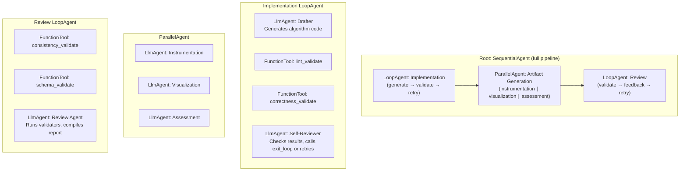
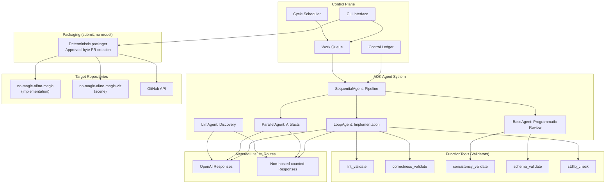
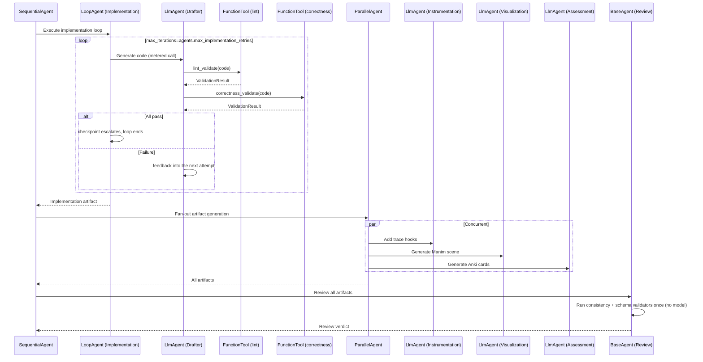
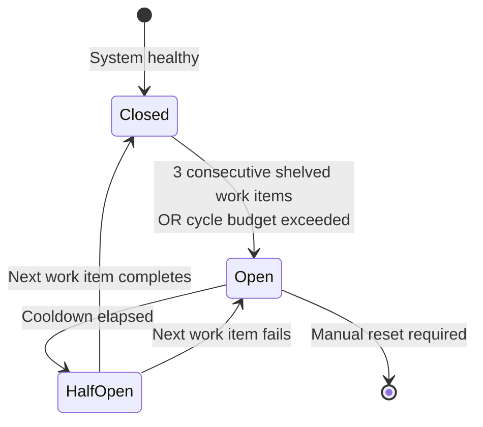
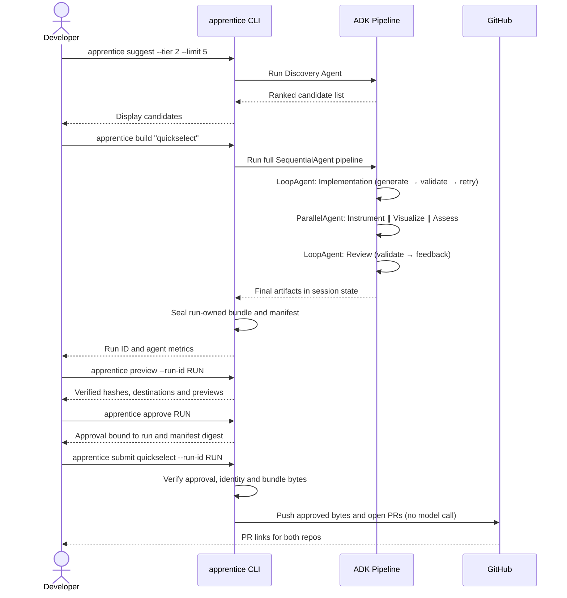
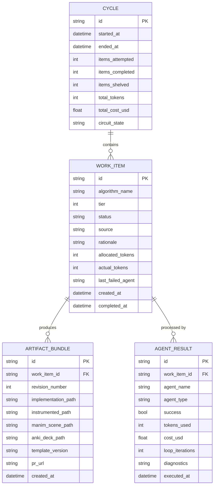

# apprentice — Multi-Agent Algorithm Factory for no-magic

> A multi-agent system built on Google ADK that implements, instruments, visualizes, tests, and ships new algorithm entries for the no-magic ecosystem. Specialist agents coordinate under an orchestrator to produce complete educational content — from algorithm selection through PR submission.

**Repository**: `no-magic-ai/apprentice`
**Parent ecosystem**: `no-magic-ai/no-magic`
**Framework**: [Google Agent Development Kit (ADK)](https://github.com/google/adk-python)
**Status (2026-10-06)**: Design reference for the implemented package (version 0.4.0, assisted mode only). Activation for autonomous operation is deferred by the umbrella strategy until the no-magic catalog reaches at least 60 algorithms and the per-algorithm template is locked, and it additionally needs separate safety, spend and human approvals. Sections below that describe containment, rate limiting, circuit breaking and later roadmap versions are design targets unless marked as current; see [Section 7](#7-containment-system) and the [README status](../README.md#status) for what the code does today.

---

## 1. Naming Rationale

`apprentice` — a learner that produces work under supervision, gradually earning autonomy. Maps directly to the v1→v2 trajectory: assisted apprentice → autonomous apprentice with guardrails.

---

## 2. Problem Statement

no-magic's generated `docs/catalog.json` lists 48 scripts across four tiers (45 `micro*` programs plus three programs without the prefix: `attention_vs_none`, `rnn_vs_gru_vs_lstm` and `adam_vs_sgd`), each requiring artifacts across multiple repositories:

| Repository | Content | Example |
|---|---|---|
| `no-magic-ai/no-magic` | Single-file, zero-dependency Python implementation (`micro{name}.py`) | `01-foundations/microlstm.py` |
| `no-magic-ai/no-magic-viz` | Manim scene (`scene_micro{name}.py`) + preview GIF (`previews/micro{name}.gif`) | `scenes/scene_microlstm.py` |
| `no-magic-ai/no-magic` | Tier README update (add to algorithm table) | `01-foundations/README.md` |
| `no-magic-ai/no-magic` | Root README update (add GIF preview card) | `README.md` |
| `no-magic-ai/no-magic` | Learning path update (add to relevant tracks) | `LEARNING_PATH.md` |
| `no-magic-ai/no-magic` | Catalog record: `SCRIPT_TO_PAPER` (paper slug) in `scripts/generate_catalog.py`, then regenerated `docs/catalog.json` (required from no-magic v3.0). When the target generator revision defines `SCRIPT_CONTRACTS` (the M1 catalog extension: teaching kind, data source, adaptation note), that record is required too; released v3 does not define it | `scripts/generate_catalog.py` |
| `no-magic-ai/no-magic-papers` | Paper card whose `implementations[]` references the script (required from no-magic v3.0) | `papers/lstm.md` |

Every new algorithm requires producing artifacts across **3 repositories** (`no-magic`, `no-magic-viz` and, from no-magic v3.0, `no-magic-papers`), maintaining consistency with existing conventions, and validating correctness. The deterministic `submit` packager currently covers `no-magic` and `no-magic-viz` only. This multi-repo coordination is the bottleneck to catalog growth.

**apprentice** automates the full artifact pipeline using a multi-agent system where specialist agents handle implementation, visualization, assessment, and review — coordinated by an ADK orchestrator that tracks budget, sequences stages and runs quality gates. **Cross-repo PR packaging** is a separate, deterministic `submit` step that promotes the human-approved bundle bytes without a model.

### 2.1 Target Repository Structure

```
no-magic-ai/no-magic/                     # Main algorithm repo
├── 01-foundations/                        # Tier 1: Core algorithms
│   ├── microgpt.py                       # Implementation (zero-dep, stdlib-only)
│   ├── microlstm.py
│   └── README.md                         # Tier-level catalog table
├── 02-alignment/                         # Tier 2: Training techniques
├── 03-systems/                           # Tier 3: Inference optimizations
├── 04-agents/                            # Tier 4: Agent algorithms
├── LEARNING_PATH.md                      # Cross-tier learning tracks
└── README.md                             # Root with GIF preview grid

no-magic-ai/no-magic-viz/                 # Visualization repo
├── scenes/
│   ├── scene_microgpt.py                 # Manim Scene subclass
│   └── scene_microlstm.py
├── previews/
│   ├── microgpt.gif                      # Rendered preview (referenced by no-magic README)
│   └── microlstm.gif
└── renders/                              # Full renders (optional)
```

### 2.2 Naming Convention

All algorithms follow the `micro{name}` pattern:
- Implementation: `micro{name}.py` in the tier directory
- Scene: `scene_micro{name}.py` in `no-magic-viz/scenes/`
- Preview: `micro{name}.gif` in `no-magic-viz/previews/`
- The `micro` prefix is mandatory for new scripts — it's the project's identity. The three existing programs without the prefix (`attention_vs_none`, `rnn_vs_gru_vs_lstm`, `adam_vs_sgd`) predate this rule; the prefix says nothing about a script's teaching kind.
- Script slugs (file basenames) and paper slugs (`no-magic-papers` card names) are separate namespaces. The script-to-paper link is written out in `SCRIPT_TO_PAPER`; never derive one slug from the other.

### 2.3 Tier Mapping

| Tier | Directory | Focus |
|---|---|---|
| 1 | `01-foundations/` | Core algorithms (GPT, RNN, tokenizer, embeddings, etc.) |
| 2 | `02-alignment/` | Training techniques (LoRA, DPO, PPO, MoE, etc.) |
| 3 | `03-systems/` | Inference optimizations (attention, KV-cache, quantization, etc.) |
| 4 | `04-agents/` | Agent algorithms (MCTS, bandit, minimax, etc.) |

---

## 3. Design Principles

| Principle | Implication |
|---|---|
| **Multi-agent by design** | Each specialist agent has a distinct role, instruction, tool access, and reasoning loop. Agent boundaries correspond to intuitive roles, not arbitrary splits. |
| **Honest agent boundaries** | Full agents use `LoopAgent` for self-correction. Tool-agents are single `LlmAgent` instances. Validators are `FunctionTool` wrappers. The tier matches the behavioral complexity. |
| **Framework over reinvention** | Google ADK provides `SequentialAgent`, `ParallelAgent`, `LoopAgent` — battle-tested orchestration primitives. No hand-rolled dispatch loops. |
| **Metered routes only** | Every model call goes through ADK's `LiteLlm` with a metering client. Only routes with a qualified accounting profile are supported: the standard-tier OpenAI Responses API and genuinely non-hosted servers that implement the counted Responses protocol. The route is chosen in config; nothing switches it automatically. |
| **Containment first** | Autonomous mode has hard budget caps, rate limits, and mandatory human checkpoints. Agents cannot escalate their own permissions. |
| **Artifact parity** | Agent-generated entries are structurally indistinguishable from hand-crafted ones. |
| **Prompt transparency** | All agent instructions are versioned and stored separately from agent logic. |
| **Explicit conventions** | Coupling to no-magic repo conventions is captured in a machine-readable schema. |

---

## 4. Multi-Agent Architecture (Google ADK)

### 4.1 Framework Choice

Google ADK is an open-source, code-first Python framework for building multi-agent systems. It provides:

- **`LlmAgent`** — wraps an LLM with instructions, tools, and session state
- **`SequentialAgent`** — runs sub-agents in order (pipeline)
- **`ParallelAgent`** — runs sub-agents concurrently
- **`LoopAgent`** — iterates sub-agents until exit condition or max iterations
- **`FunctionTool`** — wraps Python functions as agent-callable tools
- **Lifecycle callbacks** — `before_agent`, `after_agent`, `before_model`, `after_model` hooks
- **Session state** — shared state across agents via `output_key` / `{variable}` interpolation
- **Dev web UI** — built-in debugging interface (`adk web`)

**Metered model routes via LiteLlm:** every agent's `LiteLlm` gets a `MeteredResponsesClient` bound to its cycle, stage and role (`metering/client.py`). The client counts each request at `/responses/input_tokens`, reserves its bound in the installation ledger, sends it to `/responses` with the admitted `max_output_tokens`, and settles the raw usage once (see section 7.1).

### 4.2 Agent Composition

The pipeline is expressed as a hierarchy of ADK agent types:


```mermaid
graph TB
    subgraph "Root: SequentialAgent (full pipeline)"
        ImplLoop["LoopAgent: Implementation<br/>(generate → validate → retry)"]
        Parallel["ParallelAgent: Artifact Generation<br/>(instrumentation ∥ visualization ∥ assessment)"]
        ReviewLoop["LoopAgent: Review<br/>(validate → feedback → retry)"]
    end

    subgraph "Implementation LoopAgent"
        Drafter[LlmAgent: Drafter<br/>Generates algorithm code]
        LintTool[FunctionTool: lint_validate]
        CorrectTool[FunctionTool: correctness_validate]
        Reviewer1[LlmAgent: Self-Reviewer<br/>Checks results, calls exit_loop or retries]
    end

    subgraph "ParallelAgent"
        InstrAgent[LlmAgent: Instrumentation]
        VizAgent[LlmAgent: Visualization]
        AssessAgent[LlmAgent: Assessment]
    end

    subgraph "Review LoopAgent"
        ConsistTool[FunctionTool: consistency_validate]
        SchemaTool[FunctionTool: schema_validate]
        ReviewAgent[LlmAgent: Review Agent<br/>Runs validators, compiles report]
    end

    ImplLoop --> Parallel --> ReviewLoop
```

**Mapping to ADK primitives:**

| apprentice concept | ADK primitive | Why |
|---|---|---|
| Full pipeline | `SequentialAgent` | Stages run in defined order |
| Implementation with self-correction | `LoopAgent(max_iterations=agents.max_implementation_retries)` | Drafter + per-draft validation callback; a checkpoint agent escalates out once a draft passes |
| Parallel artifact generation | `ParallelAgent` | Instrumentation, visualization, assessment are independent |
| Review with validation | programmatic `BaseAgent` | Runs consistency and schema validators once; no model call |
| Multi-repo packaging | Deterministic Python, not an agent | Promotes the approved bundle bytes into coordinated PRs across `no-magic` + `no-magic-viz` |
| Validators (lint, correctness, etc.) | `FunctionTool` | Pure functions called as agent tools |
| Discovery (standalone) | `LlmAgent` with catalog tools | Multi-step reasoning with dedup tools |
| Budget enforcement | metering client per role + SQLite ledger | Reserve before dispatch, settle raw usage once (section 7.1) |

### 4.3 High-Level Architecture


```mermaid
graph TB
    subgraph Control Plane
        CLI[CLI Interface]
        Scheduler[Cycle Scheduler]
        Budget[Control Ledger]
        Queue[Work Queue]
    end

    subgraph "ADK Agent System"
        Pipeline["SequentialAgent: Pipeline"]
        DiscAgent["LlmAgent: Discovery"]
        ImplLoop["LoopAgent: Implementation"]
        ParAgent["ParallelAgent: Artifacts"]
        RevLoop["BaseAgent: Programmatic Review"]
    end

    subgraph "FunctionTools (Validators)"
        LintVal[lint_validate]
        CorrectVal[correctness_validate]
        ConsistVal[consistency_validate]
        SchemaVal[schema_validate]
        StdlibVal[stdlib_check]
    end

    subgraph "Metered LiteLlm Routes"
        GPT[OpenAI Responses]
        Local[Non-hosted counted Responses]
    end

    subgraph "Packaging (submit, no model)"
        Packager["Deterministic packager<br/>Approved-byte PR creation"]
    end

    subgraph "Target Repositories"
        NoMagic["no-magic-ai/no-magic<br/>(implementation)"]
        NoMagicViz["no-magic-ai/no-magic-viz<br/>(scene)"]
        GitHub[GitHub API]
    end

    CLI --> Queue
    Scheduler --> Queue
    Budget --> Pipeline

    Queue --> Pipeline
    Pipeline --> ImplLoop
    Pipeline --> ParAgent
    Pipeline --> RevLoop
    CLI --> Packager

    ImplLoop --> LintVal
    ImplLoop --> CorrectVal
    ImplLoop --> StdlibVal
    RevLoop --> ConsistVal
    RevLoop --> SchemaVal

    ImplLoop --> GPT
    ParAgent --> GPT
    DiscAgent --> GPT
    ImplLoop --> Local
    ParAgent --> Local
    DiscAgent --> Local

    Packager --> GitHub
    Packager --> NoMagic
    Packager --> NoMagicViz
```

### 4.4 Agent Execution Flow


```mermaid
sequenceDiagram
    participant Pipe as SequentialAgent
    participant Impl as LoopAgent (Implementation)
    participant Draft as LlmAgent (Drafter)
    participant Lint as FunctionTool (lint)
    participant Correct as FunctionTool (correctness)
    participant ToolStage as ParallelAgent
    participant Instr as LlmAgent (Instrumentation)
    participant Viz as LlmAgent (Visualization)
    participant Assess as LlmAgent (Assessment)
    participant Rev as BaseAgent (Review)

    Pipe->>Impl: Execute implementation loop

    loop max_iterations=agents.max_implementation_retries
        Impl->>Draft: Generate code (metered call)
        Draft->>Lint: lint_validate(code)
        Lint-->>Draft: ValidationResult
        Draft->>Correct: correctness_validate(code)
        Correct-->>Draft: ValidationResult
        alt All pass
            Impl->>Impl: checkpoint escalates, loop ends
        else Failure
            Draft->>Draft: feedback into the next attempt
        end
    end

    Impl-->>Pipe: Implementation artifact

    Pipe->>ToolStage: Fan-out artifact generation
    par Concurrent
        ToolStage->>Instr: Add trace hooks
        ToolStage->>Viz: Generate Manim scene
        ToolStage->>Assess: Generate Anki cards
    end
    ToolStage-->>Pipe: All artifacts

    Pipe->>Rev: Review all artifacts
    Rev->>Rev: Run consistency + schema validators once (no model)
    Rev-->>Pipe: Review verdict
```

### 4.5 Provider Configuration

The route is selected via `config/apprentice.toml` and qualified by an operator-supplied accounting profile ([Configuration](configuration.md#accounting-profile)):

```toml
[provider]
backend = "openai"                 # openai | local
model = "openai/gpt-5.4"           # the profile's requested_model
local_api_base = ""                # loopback URL, local only
accounting_profile_path = ""       # empty: every model call is denied
```

| Backend | Endpoint | Requirements |
|---|---|---|
| `openai` | exactly `https://api.openai.com/v1`, standard tier, `store=false` | `OPENAI_API_KEY`; `openai-standard-responses` profile with the counting-fee bound |
| `local` | loopback IP `local_api_base` | server implementing `/responses/input_tokens` and `/responses` for the profiled model; `non-hosted-responses` profile |

The Anthropic, Gemini, Ollama and `claude -p` backends were removed: none is metered by a qualified profile. Plain chat-completions servers (Ollama, llama.cpp) do not qualify as `local` by themselves.

### 4.6 Component Breakdown


```mermaid
graph LR
    subgraph apprentice
        direction TB
        A[core/] --> A1[orchestrator.py<br/>ADK SequentialAgent pipeline builder]
        A --> A2[cycles.py<br/>Controlled, metered work cycles]
        A --> A3[queue.py<br/>Work item management]
        A --> A4[observability.py<br/>Logging, metrics, alerts]

        B[agents/] --> B1[discovery.py<br/>LlmAgent with catalog tools]
        B --> B2[implementation.py<br/>LoopAgent: drafter + validation checkpoint]
        B --> B3[instrumentation.py<br/>LlmAgent: trace hook injection]
        B --> B4[visualization.py<br/>LlmAgent: Manim scene generation]
        B --> B5[assessment.py<br/>LlmAgent: Anki card generation]
        B --> B6[review.py<br/>Programmatic review, no model]
        B --> B7[packaging.py<br/>Deterministic approved-byte PR creation]

        C[validators/] --> C1[lint.py → FunctionTool]
        C --> C2[correctness.py → FunctionTool]
        C --> C3[consistency.py → FunctionTool]
        C --> C4[schema_compliance.py → FunctionTool]

        D[providers/] --> D1[factory.py<br/>Qualified route resolution and binding]

        E[config/] --> E1[apprentice.toml]
        E --> E2[catalog.toml]
        E --> E3[no-magic-schema.yaml]
        E --> E4[templates/]
    end
```

---

## 5. Agent Specifications

### 5.1 Discovery Agent — `LlmAgent`

**ADK type**: `LlmAgent` with `FunctionTool`s for catalog access and dedup

**Instruction**: Analyze the no-magic catalog, identify tier gaps, suggest candidate algorithms, deduplicate against existing entries.

**Tools**:
- `load_catalog()` — reads `catalog.toml`, returns existing algorithms with aliases
- `check_duplicate(name, existing)` — Levenshtein similarity check (≥0.85 threshold)
- `validate_name(name)` — checks `[a-z0-9_]` whitelist

**Session state output**: `discovery_candidates` — JSON list of non-duplicate candidates

### 5.2 Implementation Agent — `LoopAgent`

**ADK type**: `LoopAgent(max_iterations=agents.max_implementation_retries)` containing:
1. `LlmAgent("drafter")` — generates stdlib-only Python implementation; its after-agent callback runs `stdlib_check`, `lint_validate` and `correctness_validate` on every draft (programmatically, not as model tools) and writes `validation_feedback` and `implementation_passed`
2. `BaseAgent("implementation_checkpoint")` — escalates out of the loop when the latest draft passed

The drafter's instruction includes `{validation_feedback?}`, so a failed draft's issues reach the next attempt. The loop's iteration count is the total number of drafts, including the first.

**Session state output**: `implementation_path` — path to validated implementation file

### 5.3 Instrumentation Agent — `LlmAgent`

**ADK type**: Single `LlmAgent` (tool-agent, no self-correction)

**Instruction**: Add JSON trace hooks (`step`, `operation`, `state`) at algorithmic decision points.

**Input**: `{implementation_path}` from session state
**Output**: `instrumented_path` in session state

### 5.4 Visualization Agent — `LlmAgent`

**ADK type**: Single `LlmAgent` (tool-agent)

**Instruction**: Generate Manim animation steps for the scaffold template. Output only the animation sequence, not the full Scene class.

**Tools**: `load_template()` — reads `manim_scene.py.j2` scaffold
**Input**: `{implementation_path}` from session state
**Output**: `manim_scene_path` in session state

### 5.5 Assessment Agent — `LlmAgent`

**ADK type**: Single `LlmAgent` (tool-agent)

**Instruction**: Generate Anki flashcard CSV with 4 card types (concept, complexity, implementation, comparison), minimum 8 cards.

**Input**: `{implementation_path}` from session state
**Output**: `anki_deck_path` in session state

### 5.6 Review Agent — programmatic `BaseAgent`

**ADK type**: `BaseAgent("reviewer")` — runs `consistency_validate` and `schema_validate` once over all artifacts in the run's work root. It makes no model call and has no budget share.

**Session state output**: `review_verdict` — `passed` or `failed: <per-artifact diagnostics>`

### 5.7 Packaging — deterministic, not an agent

**Current (0.4.0)**: `apprentice submit <algorithm> --run-id <run-id>` promotes the exact bytes a human approved. It runs no model, generation graph, drafting or rendering.

**Execution flow**:
1. Under a short exclusive lock on the run (`runs/<run-id>.lock`), the record is reloaded and the review gate (`gates/review.py`) loads the run's sealed bundle once, verifies every artifact against its canonical manifest, refuses a run whose build recorded a failed blocking gate, requires the approval (run ID, algorithm, tier, manifest digest), the run record, the bundle and the requested algorithm/tier to agree, and requires a well-formed approver and canonical timezone-aware approval time. A run with any recorded attempt is refused; otherwise a fresh scratch root is allocated and the attempt is saved as `pending` before the lock is released. Failures stop before any clone.
2. Clone `no-magic-ai/no-magic` and `no-magic-ai/no-magic-viz` into an exclusive scratch root and create branch `apprentice/<run-id>` in each.
3. Write the verified bytes to their manifest destinations, refusing existing files and symlinked directories:
   - implementation → `no-magic/{tier_dir}/micro{name}.py`
   - Manim scene → `no-magic-viz/scenes/scene_micro{name}.py`
4. Stage only those paths, commit with the approval time as author/committer date, and check that each commit contains exactly the approved bytes and paths.
5. Push both branches, then open the `no-magic` PR and a `no-magic-viz` PR that references it, with `gh`. Under the lock again, the attempt ends `complete`, `partial` (with the branches pushed and PRs opened before the error, `null` for a push or PR whose command timed out) or `failed`, but only if the stored attempt is still the one reserved in step 1; otherwise nothing is saved and the known effects are printed. Any recorded attempt blocks another `submit` and any re-approval of that run, with no retry or resume.

Packaging never merges. It uses the operator's ambient `git` and `gh` credentials; credential scoping is open containment work (see the [README status](../README.md#status)).

**Design targets, not implemented**: rendering `micro{name}.gif` into `no-magic-viz/previews/`; updating `{tier_dir}/README.md`, the root `README.md` and `LEARNING_PATH.md`; and the paper-aware records released no-magic v3 requires (a `no-magic-papers` card and `SCRIPT_TO_PAPER`, plus `SCRIPT_CONTRACTS` where the target generator defines it).

---

## 6. Validators as FunctionTools

Validators are pure Python functions wrapped with ADK's `FunctionTool`. Agents call them as tools during their execution — the LLM decides when to invoke validation based on its instruction.

```python
from google.adk.tools import FunctionTool


def lint_validate(code_path: str) -> dict:
    """Validate Python code for syntax, docstrings, type annotations, and style."""
    result = LintValidator().validate({"implementation": code_path}, work_item)
    return result.to_dict()


lint_tool = FunctionTool(func=lint_validate)
```

| Validator | Tool Name | Returns |
|---|---|---|
| Lint | `lint_validate` | Issues with suggestions: "Add type annotations to 'foo'" |
| Correctness | `correctness_validate` | Pass/fail with stderr excerpt |
| Consistency | `consistency_validate` | Cross-artifact name/complexity match |
| Schema Compliance | `schema_validate` | Convention conformance per `no-magic-schema.yaml` |

---

## 7. Containment System

**Current implementation.** Budgets are enforced as described in 7.1. Correctness validation runs generated code with `subprocess.run` and a 5-second timeout after every draft and in the correctness gate, which is not a sandbox. Rate limits, cooldown, PR-size limits and the circuit breaker are parsed configuration that no code enforces yet (`core/circuit_breaker.py`, `core/queue.py` and `core/scheduler.py` are empty modules). None of this is certified containment.

### 7.1 Budget Enforcement (reserve, dispatch, settle)

Budgets are enforced at each role's model client against one durable installation ledger (`controls/accounting.sqlite3` under the run-record store, with `flock` cycle leases), not by agent callbacks:

1. A controlled cycle (`build`, `retry`, `suggest`, library build) is admitted in one ledger transaction and holds a lease until its terminal outcome is committed.
2. For each call, the counting fee bound is reserved and the complete Responses input is counted; then counted input plus the largest output cap admitted by every scope — UTC month, cycle, stage, role percentage share, single call — is reserved with its worst-case USD quote, and dispatch intent is persisted before the request is sent.
3. The raw usage is settled exactly once before SDK conversion; unused allowance is refunded. Failure, cancellation or owner loss after dispatch keeps the full bound as unknown; contradictory or above-bound usage is charged and quarantines the profile.

Tokens are input plus all output (cached and reasoning tokens are subsets). USD is an exact policy quote in nanodollars from the pinned price data — a qualified-price quote for the paid route, modelled reference capacity or known-zero hosted cost for non-hosted routes — never an invoice.

**Hierarchy**: month → cycle → stage → role share → call.

### 7.2 Rate Limiting

| Limit | Default | Configurable |
|---|---|---|
| Max PRs per day | 2 | Yes |
| Max PRs per week | 5 | Yes |
| Max algorithms per cycle | 3 | Yes |
| Max concurrent work items | 1 | Yes |
| Cooldown between cycles | 4 hours | Yes |
| Max implementation loop iterations | 3 | No (hard cap) |
| Max review loop iterations | 2 | No (hard cap) |

### 7.3 Circuit Breaker


```mermaid
stateDiagram-v2
    [*] --> Closed: System healthy
    Closed --> Open: 3 consecutive shelved work items<br/>OR cycle budget exceeded
    Open --> HalfOpen: Cooldown elapsed
    HalfOpen --> Closed: Next work item completes
    HalfOpen --> Open: Next work item fails
    Open --> [*]: Manual reset required
```

### 7.4 Input Sanitization

| Input Source | Sanitization |
|---|---|
| Algorithm names | Whitelist: `[a-z0-9_]`, max 64 chars |
| GitHub issue descriptions | Strip prompt control sequences before agent context |
| PR review comments | Parsed for actionable feedback only |
| Inter-agent state | ADK session state — structured, no free-form injection |

---

## 8. User Workflow — Assisted Mode (v1)

Current CLI flow (0.4.0): `build` runs the pipeline through review and seals the run's artifacts into an immutable run-owned bundle; `preview` verifies and shows that bundle; `apprentice approve <run-id>` binds a human approval to the run identity and bundle manifest digest; `submit <algorithm> --run-id <run-id>` re-verifies the approval and bundle and promotes exactly the approved bytes into PRs without calling a model (see [5.7](#57-packaging--deterministic-not-an-agent)).


```mermaid
sequenceDiagram
    actor Dev as Developer
    participant CLI as apprentice CLI
    participant ADK as ADK Pipeline
    participant GH as GitHub

    Dev->>CLI: apprentice suggest --tier 2 --limit 5
    CLI->>ADK: Run Discovery Agent
    ADK-->>CLI: Ranked candidate list
    CLI-->>Dev: Display candidates

    Dev->>CLI: apprentice build "quickselect"
    CLI->>ADK: Run full SequentialAgent pipeline
    ADK->>ADK: LoopAgent: Implementation (generate → validate → retry)
    ADK->>ADK: ParallelAgent: Instrument ∥ Visualize ∥ Assess
    ADK->>ADK: LoopAgent: Review (validate → feedback)
    ADK-->>CLI: Final artifacts in session state
    CLI->>CLI: Seal run-owned bundle and manifest
    CLI-->>Dev: Run ID and agent metrics

    Dev->>CLI: apprentice preview --run-id RUN
    CLI-->>Dev: Verified hashes, destinations and previews

    Dev->>CLI: apprentice approve RUN
    CLI-->>Dev: Approval bound to run and manifest digest

    Dev->>CLI: apprentice submit quickselect --run-id RUN
    CLI->>CLI: Verify approval, identity and bundle bytes
    CLI->>GH: Push approved bytes and open PRs (no model call)
    GH-->>Dev: PR links for both repos
```

### CLI Commands

```
apprentice suggest [--tier N] [--limit N]               # Discovery Agent
apprentice build <algorithm> [--tier N]                 # Full ADK pipeline through review
apprentice preview [--run-id ID]                        # Verify and inspect a sealed bundle
apprentice approve <run-id> [--approver NAME]           # Record human-review approval
apprentice submit <algorithm> --run-id ID [--tier N]    # Promote approved bytes; no model call
apprentice status                                       # Configured limits vs ledger state, route check
apprentice controls adopt-legacy --operator NAME --declare-no-earlier-process-running
apprentice metrics                                      # Aggregated run metrics
apprentice history [--status S] [--limit N]             # Past runs
apprentice retry <run-id>                               # Re-run a failed pipeline run
apprentice config                                       # Display apprentice.toml
apprentice dev [--port N]                               # ADK dev UI
```

`build --from-issue` and `reset-circuit` are not implemented.

---

## 9. Configuration — `apprentice.toml`

The shipped `config/apprentice.toml`, which `core/config.py` parses; every section below is required and removed keys are rejected ([Configuration](configuration.md#removed-settings)). Section 7 lists which budget, rate-limit and circuit-breaker settings are enforced today.

```toml
[budget.global]
monthly_token_ceiling = 2_000_000
monthly_cost_ceiling_usd = 50.0

[budget.cycle]
max_tokens_per_cycle = 100_000
max_cost_per_cycle_usd = 5.0

[budget.stage]
max_tokens_per_stage = 20_000

[rate_limits]
max_prs_per_day = 2
max_prs_per_week = 5
max_concurrent_items = 1
cooldown_hours = 4
max_files_per_pr = 10
max_lines_per_pr = 2000

[budget.agent]
max_tokens_per_agent_call = 20_000
implementation_budget_pct = 40
tool_agent_budget_pct = 15

[agents]
max_implementation_retries = 3

[circuit_breaker]
failure_threshold = 3
half_open_probe_after_minutes = 60
max_open_cycles_before_manual_reset = 3

[provider]
backend = "openai"
model = "openai/gpt-5.4"
local_api_base = ""
accounting_profile_path = ""

[observability]
log_level = "INFO"
log_format = "json"
log_path = "${HOME}/.apprentice/logs"
metrics_enabled = true

[templates]
version = "1.0.0"
base_path = "config/templates"
```

---

## 10. Data Model

### 10.1 Entity Relationships


```mermaid
erDiagram
    WORK_ITEM {
        string id PK
        string algorithm_name
        int tier
        string status
        string source
        string rationale
        int allocated_tokens
        int actual_tokens
        string last_failed_agent
        datetime created_at
        datetime completed_at
    }

    ARTIFACT_BUNDLE {
        string id PK
        string work_item_id FK
        int revision_number
        string implementation_path
        string instrumented_path
        string manim_scene_path
        string anki_deck_path
        string template_version
        string pr_url
        datetime created_at
    }

    AGENT_RESULT {
        string id PK
        string work_item_id FK
        string agent_name
        string agent_type
        bool success
        int tokens_used
        float cost_usd
        int loop_iterations
        string diagnostics
        datetime executed_at
    }

    CYCLE {
        string id PK
        datetime started_at
        datetime ended_at
        int items_attempted
        int items_completed
        int items_shelved
        int total_tokens
        float total_cost_usd
        string circuit_state
    }

    WORK_ITEM ||--o{ ARTIFACT_BUNDLE : "produces"
    WORK_ITEM ||--o{ AGENT_RESULT : "processed by"
    CYCLE ||--o{ WORK_ITEM : contains
```

---

## 11. Version Roadmap

| Version | Scope | Mode |
|---|---|---|
| **v0.1** | CLI scaffold, provider interface, single-stage implementation | Assisted only |
| **v0.2** | Full pipeline (all stages), quality gates | Assisted only |
| **v0.3** | Agent foundation: custom orchestrator, implementation agent, validators | Assisted only |
| **v0.4** | ADK migration: replace custom orchestrator with ADK primitives, all agents, local LLM support — **current package version (0.4.0)** | Assisted only |
| **v1.0** | Stable assisted mode, ≥95% success rate | **Assisted — release** |
| **v1.1** | Scheduler, work queue, cycle management | Autonomous foundations |
| **v1.2** | Circuit breaker, rate limiting, full containment | Autonomous safeguards |
| **v1.3** | Discovery Agent (autonomous candidate selection) | Autonomous discovery |
| **v1.4** | Observability: agent metrics, cost dashboard, alerting | Autonomous monitoring |
| **v2.0** | Full autonomous mode. Read-only launch (opens PRs, human merges). | **Autonomous — release** |
| **v2.1** | Review Agent feedback loop (revises from PR review comments) | Autonomous refinement |

Versions after v0.4 are design targets with no assigned dates. No autonomous row may be activated before the umbrella activation gate (catalog ≥60 algorithms and a locked per-algorithm template) and separate safety, spend and human approvals are met.

---

## 12. Repository Structure

```
no-magic-ai/apprentice/
├── src/
│   └── apprentice/
│       ├── __init__.py
│       ├── cli.py                    # CLI entry point
│       ├── core/
│       │   ├── orchestrator.py       # ADK pipeline builder (SequentialAgent)
│       │   ├── cycles.py             # Controlled, metered work cycles
│       │   ├── budget.py             # Gate verdicts + ledger reference of a run
│       │   ├── queue.py              # Work item management (empty placeholder)
│       │   ├── circuit_breaker.py    # Failure containment (empty placeholder)
│       │   ├── scheduler.py          # Autonomous cycle scheduling (empty placeholder)
│       │   └── observability.py      # Structured logging, metrics
│       ├── agents/
│       │   ├── discovery.py          # LlmAgent with catalog tools
│       │   ├── implementation.py     # LoopAgent: drafter + validation checkpoint
│       │   ├── instrumentation.py    # LlmAgent (tool-agent)
│       │   ├── visualization.py      # LlmAgent (tool-agent)
│       │   ├── assessment.py         # LlmAgent (tool-agent)
│       │   ├── review.py             # Programmatic review agent (no model)
│       │   └── packaging.py          # Deterministic approved-byte PR creation
│       ├── validators/
│       │   ├── base.py               # ValidationResult, ValidationIssue
│       │   ├── lint.py               # → FunctionTool
│       │   ├── correctness.py        # → FunctionTool
│       │   ├── consistency.py        # → FunctionTool
│       │   └── schema_compliance.py  # → FunctionTool
│       ├── controls/                 # Installation ledger, leases, policy, footprint
│       ├── metering/                 # Price authority, accounting profiles, metered client
│       ├── providers/
│       │   └── factory.py            # Qualified route resolution and binding
│       ├── prompts/                  # Agent instructions (YAML)
│       └── models/                   # WorkItem, ArtifactBundle, etc.
├── config/
│   ├── apprentice.toml
│   ├── catalog.toml
│   ├── no-magic-schema.yaml
│   └── templates/
│       └── manim_scene.py.j2
├── tests/
├── pyproject.toml
├── README.md
└── LICENSE
```

---

## 13. Open Design Questions

| # | Question | Decision |
|---|---|---|
| 1 | State persistence | **SQLite** — queryable budget history, transaction safety. |
| 2 | Template engine | **Jinja2** — one dependency, massive complexity reduction. |
| 3 | Manim validation | **Headless render** — AST can't catch runtime errors. |
| 4 | Anki export format | **CSV for v1.0**, `.apkg` as enhancement. |
| 5 | Autonomous trigger | **GitHub Actions** — runs where the repo lives. |

### Remaining Open Questions

| # | Question | Context |
|---|---|---|
| 6 | ADK session persistence | ADK supports `InMemorySessionService` and custom backends. Use SQLite-backed session for durable state across runs? |
| 7 | ADK dev web UI deployment | Run `adk web` locally during development. How to integrate with CI? |
| 8 | Local model quality threshold | Non-hosted models may produce lower quality than hosted ones. Should validators be stricter for local models? |
